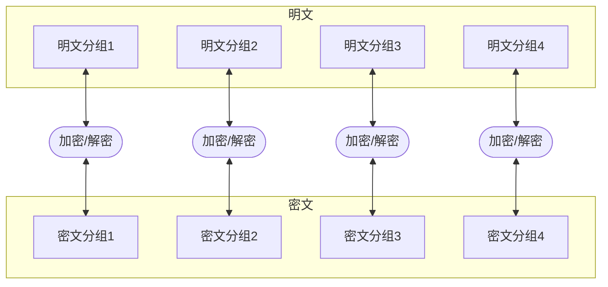
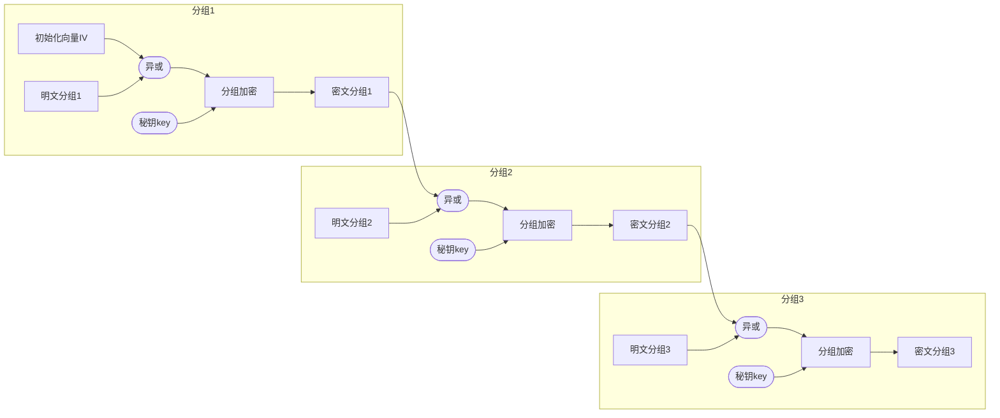
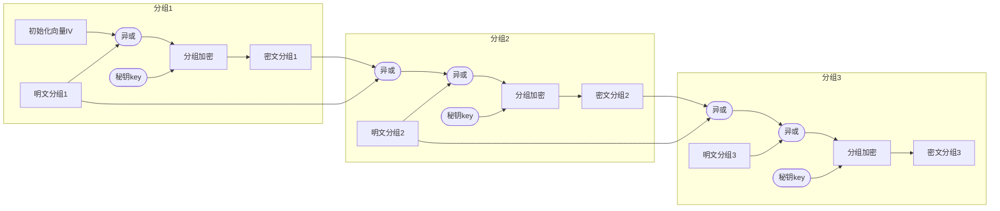

### 概述

- des是一种将64位（8字节）明文加密成64比特密文的对称加密算法
  
  - 有效密钥的长度是56比特，
  
  - 实际des密钥长64比特（8字节），每7比特设置一个校验比特；

- des是一种分组加密（多种算法的基本操作）,即每次将8字节明文转为8字节密文

- 分组加密的迭代称为加密模式，几乎大部分加密方式通用

- des的基本结构是有Feistel设计的，因此也称为feistel结构或者feistel密码；feistel加密的各个步骤称为轮，整个加密过程就是进行若干次轮的循环，des是一种16轮循环的feistel网络；

### 加密模式

##### 加密类型

- **对称加密**
  
  - **分组加密**
  
  - **序列密码**

- **非对称加密**

- **散列算法**

##### 分组加密 和 序列加密

- **分组加密**（块加密）：
  
  - 以块为单位进行加密，明文按一定位长分组成块，明文块加密后得到密文组
  
  - 解密类似，密文组解密还原成明文组。常见的有 DES，AES，3DES等。

- **序列加密**（流加密）：
  
  - 以位为单位进行加密，利用少量的密钥通过某种复杂的密码算法进行运算产生大量的伪随机位流，用于对明文位流的加密。

##### 常见的分组加密的模式

**1.ECB（Electronic codebook，ECB）电子密码本模式**

- 原理：最基本的工作模式，将待处理信息分组，每组分别进行加密或解密处理

- 加密解密图：



- 说明：
  
  - 数据分组 + 各组加密/解密

- 优点：
  
  - 简单，易实现，可并行

- 缺点：
  
  - 各组加密方式一致，可根据密文情况观察明文情况，有被破解的风险，不安全
  
  - 密文分组相互独立易被攻击，数据保密性差，可以对明文攻击；

**2.CBC（Cipher-block chaining，CBC）密码分组链接模式**

- 原理：每个明文块先与其前一个密文块进行异或，然后再进行加密

- 加密解密图：



- 

- 说明：
  
  - 每个密文块依赖于前一个明文块,各段数据间存在联系,保证每条消息的唯一性
  
  - 第一个块中需要使用初始化向量IV
  
  - 加密时第一块后的每块与前一个密文异或再加密`Ci = Ek (P ⊕ Ci-1), C0 = IV`
  
  - 解密时密文仅影响该明文与后一个明文 `Pi = Dk (Ci) ⊕Ci-1, C0 = IV`

- 优点：
  
  - 无法直接从密文中看出明文信息块的规律，安全性比较好
  
  - 密文块依赖所有信息块，一个明文块改变则影响所有密文块
  
  - 加密解密过程都需要初始化向量（而且要相同）

- 缺点：
  
  - 具备依赖性，加密过程是串行的，无法被并行化
  
  - 但解密可以并行化，因为一个密文仅影响到该明文与后一个明文
  
  - 消息必须是块大小的整数倍，不够需要填充

**3.PCBC（Propagating cipher-block chaining，PCBC）填充密码块链接模式/明文密码块链接**

- 原理：加解密时，每个明文块与上一个**密文及明文**异或

- 加密解密图：




- 说明：
  
  - 每个密文块依赖前面的明文和密文块,各段数据间存在联系,保证每条消息唯一性
  
  - 第一个块中需要使用初始化向量IV
  
  - 加密时,首块外每块与前一块明文/密文异或再加密`Ci = Ek (Pi ⊕ Ci-1 ⊕ Pi-1 ), C0 = IV`
  
  - 解密时,首块外每块解密后与前一块明文/密文异或`Pi = Dk (Ci) ⊕ Ci-1 ⊕ Pi-1 , C0 = IV`

- 优点：
  
  - 无法直接从密文中看出明文信息块的规律，安全性比较好
  
  - 密文块依赖所有信息块，一个明文块改变则影响所有密文块
  
  - 加密解密过程都需要初始化向量（而且要相同）

- 缺点：
  
  - 具备依赖性，加密/解密过程都是串行的，无法被并行化
  
  - 消息必须是块大小的整数倍，不够需要填充

**4.CFB（Cipher feedback，CFB）密文反馈模式**

- 原理：前一个密文使用秘钥Key再加密后，与明文异或，得到密文。第一个密文需要初始向量IV加密得到。解密也同样使用加密器进行解密

- 加密解密图：


- 说明：
  
  - 第一个块中需要使用初始化向量IV将位移寄存器初始化
  
  - 加密:通过密钥key加密后与明文进行异或得到密文，加密依赖前一个密文
  
  - 解密:通过密钥加密后，与密文进行异或得到明文
  
  - 当前的密文仅影响当前的明文与下一个明文

- 优点：
  
  - 隐藏了明文模式
  
  - 加密前后的数据位数是相同的，消息必须是块大小的整数倍，不够需要填充
  
  - 可以及时加密传送小于分组的数据

- 缺点：
  
  - 与CBC类似，加密不利于并行计算，解密可以并行计算
  
  - 加密时一个明文单元损坏影响多个单元、
  
  - 加密解密需要唯一的一个与块的大小相同的移位寄存器，并用初始化向量IV将寄存器初始化

**5.OFB（Output feedback，OFB）输出反馈模式**

- 原理： 首先用 块加密器 生成 密钥流（Keystream），然后再将密钥流与明文流异或得到密文流；解密是先用块加密器生成密钥流，再将密钥流与密文流异或得到明文 （与CFB类似）

- 加密解密图：


- 说明：

第一个块中都需要使用初始化向量IV
加密：通过密钥key加密后与明文进行异或得到密文，后面所有的加密都依赖于前一个加密后的输出，CFB是依赖前一个密文
解密：通过密钥加密后，与密文进行异或得到明文，当前的 加密后的输出 会影响当前的明文与下一个明文，不会影响所有明文的生成，CFB是 密文会影响，而不是加密后的输出
优点：

隐藏了明文模式
加密前后的数据位数是相同的，上面两种都需要是块的整数倍（可能会填充）
可以及时加密传送小于分组的数据
缺点：

与CBC类似，加密不利于并行计算，解密可以并行计算
加密时一个明文单元损坏影响多个单元
加密解密需要唯一的一个与块的大小相同的移位寄存器，并用初始化向量IV将寄存器初始化
6、CTR（Counter mode，CTR）计数器模式
原理： 与OFB相似，CTR将块密码变为流密码。它通过递增一个加密计数器以产生连续的密钥流，其中，计数器可以是任意保证长时间不产生重复输出的函数

加密解密图：

说明：

加密：通过密钥key加密后与明文进行异或得到密文
解密：通过密钥加密后，与密文进行异或得到明文
优点：

允许并行计算、允许同时处理多块明文 / 密文
可随机访问，算法和加密盒的输出不依靠明文和密文的输入，因此如果有足够的保证安全的存储器，加密算法将仅仅是一系列异或运算，这将极大地提高吞吐量。
与CFB一样，无需填充
其他：（不常用，了解即可）

CCM是Cipher Block Chaining Message Authentication Code (CBC-MAC)和Counter模式（CTR）的组合
GCM是Galois message authentication code mode, 伽罗瓦消息验证码 （GMAC）与Counter模式（CTR）的组合

### 代码参考

```cpp
#include<stdio.h>
#include<string.h>
#include<stdlib.h>
/*------------------------
     定义枚举型全局变量
------------------------*/
typedef enum
  {
    false = 0,
    true  = 1
  } bool;

  // 十六轮子密钥
static bool SubKey[16][48]={0};

 /*---------------------*/
/*-------------------------------------------------------------
     各种置换表
-------------------------------------------------------------*/
// IP置换表
const char IP_Table[64]={             
 58,50,42,34,26,18,10, 2,60,52,44,36,28,20,12, 4,
 62,54,46,38,30,22,14, 6,64,56,48,40,32,24,16, 8,
 57,49,41,33,25,17, 9, 1,59,51,43,35,27,19,11, 3,
 61,53,45,37,29,21,13, 5,63,55,47,39,31,23,15, 7 
};
// IP-1置换表
const char IPR_Table[64]={              
 40, 8,48,16,56,24,64,32,39, 7,47,15,55,23,63,31,
 38, 6,46,14,54,22,62,30,37, 5,45,13,53,21,61,29,
 36, 4,44,12,52,20,60,28,35, 3,43,11,51,19,59,27,
 34, 2,42,10,50,18,58,26,33, 1,41, 9,49,17,57,25 
};

// E扩展表
static char E_Table[48]={
 32, 1, 2, 3, 4, 5, 4, 5, 6, 7, 8, 9,
  8, 9,10,11,12,13,12,13,14,15,16,17,
    16,17,18,19,20,21,20,21,22,23,24,25,
    24,25,26,27,28,29,28,29,30,31,32, 1
};
// PC1置换表
static char PC1_Table[56]={
 57,49,41,33,25,17, 9, 1,58,50,42,34,26,18,
 10, 2,59,51,43,35,27,19,11, 3,60,52,44,36,
 63,55,47,39,31,23,15, 7,62,54,46,38,30,22,
 14, 6,61,53,45,37,29,21,13, 5,28,20,12, 4
};

// pc2表     
static char PC2_Table[48]={
 14,17,11,24, 1, 5, 3,28,15, 6,21,10,
 23,19,12, 4,26, 8,16, 7,27,20,13, 2,
 41,52,31,37,47,55,30,40,51,34,33,48,
 44,49,39,56,34,53,46,42,50,36,29,32 
};
//  移位表
static char Move_Table[16]={
  1, 1, 2, 2, 2, 2, 2, 2, 1, 2, 2, 2, 2, 2, 2, 1
};
 // S盒
static char S_Box[8][4][16]={
 //S1
 14, 4,13, 1, 2,15,11, 8, 3,10, 6,12, 5, 9, 0, 7,
  0,15, 7, 4,14, 2,13, 1,10, 6,12,11, 9, 5, 3, 8,
  4, 1,14, 8,13, 6, 2,11,15,12, 9, 7, 3,10, 5, 0,
 15,12, 8, 2, 4, 9, 1, 7, 5,11, 3,14,10, 0, 6,13,
 //S2
 15, 1, 8,14, 6,11, 3, 4, 9, 7, 2,13,12, 0, 5,10,
  3,13, 4, 7,15, 2, 8,14,12, 0, 1,10, 6, 9,11, 5,
  0,14, 7,11,10, 4,13, 1, 5, 8,12, 6, 9, 3, 2,15,
 13, 8,10, 1, 3,15, 4, 2,11, 6, 7,12, 0, 5,14, 9,
 //S3
 10, 0, 9,14, 6, 3,15, 5, 1,13,12, 7,11, 4, 2, 8,
 13, 7, 0, 9, 3, 4, 6,10, 2, 8, 5,14,12,11,15, 1,
 13, 6, 4, 9, 8,15, 3, 0,11, 1, 2,12, 5,10,14, 7,
  1,10,13, 0, 6, 9, 8, 7, 4,15,14, 3,11, 5, 2,12,
 //S4
  7,13,14, 3, 0, 6, 9,10, 1, 2, 8, 5,11,12, 4,15,
 13, 8,11, 5, 6,15, 0, 3, 4, 7, 2,12, 1,10,14, 9,
 10, 6, 9, 0,12,11, 7,13,15, 1, 3,14, 5, 2, 8, 4,
  3,15, 0, 6,10, 1,13, 8, 9, 4, 5,11,12, 7, 2,14,
 //S5
  2,12, 4, 1, 7,10,11, 6, 8, 5, 3,15,13, 0,14, 9,
 14,11, 2,12, 4, 7,13, 1, 5, 0,15,10, 3, 9, 8, 6,
  4, 2, 1,11,10,13, 7, 8,15, 9,12, 5, 6, 3, 0,14,
 11, 8,12, 7, 1,14, 2,13, 6,15, 0, 9,10, 4, 5, 3,
 //S6
 12, 1,10,15, 9, 2, 6, 8, 0,13, 3, 4,14, 7, 5,11,
 10,15, 4, 2, 7,12, 0, 5, 6, 1,13,14, 0,11, 3, 8,
  9,14,15, 5, 2, 8,12, 3, 7, 0, 4,10, 1,13,11, 6,
     4, 3, 2,12, 9, 5,15,10,11,14, 1, 7, 6, 0, 8,13,
 //S7
  4,11, 2,14,15, 0, 8,13, 3,12, 9, 7, 5,10, 6, 1,
 13, 0,11, 7, 4, 0, 1,10,14, 3, 5,12, 2,15, 8, 6,
  1, 4,11,13,12, 3, 7,14,10,15, 6, 8, 0, 5, 9, 2,
  6,11,13, 8, 1, 4,10, 7, 9, 5, 0,15,14, 2, 3,12,
 //S8
 13, 2, 8, 4, 6,15,11, 1,10, 9, 3,14, 5, 0,12, 7,
  1,15,13, 8,10, 3, 7, 4,12, 5, 6,11, 0,14, 9, 2,
  7,11, 4, 1, 9,12,14, 2, 0, 6,10,13,15, 3, 5, 8,
  2, 1,14, 7, 4,10, 8,13,15,12, 9, 0, 3, 5, 6,11
};
 //P置换表
static char P_Table[32]={
 16, 7,20,21,29,12,28,17, 1,15,23,26, 5,18,31,10,
  2, 8,24,14,32,27, 3, 9,19,13,30, 6,22,11, 4,25
};
/*-------------------------------------------------------------------*/

/*-----------------------------自定义函数-----------------------------*/
void SetKey(char My_key[8]); //生成16轮的子密钥；
void ByteToBit(bool * Data_out,char * Data_in,int Num); //字节转换成位；
void Change_bit(bool * Data_out,int Num);//二进制的位置进行转换；
void BitToByte(char My_message[8],bool * Message_in,int Num); //位转换成字节；
void TableReplace(bool *Data_out,bool *Data_in,const char *Table,int Num);  //各种表的置换算法；
void Bitcopy(bool * Data_out,bool * Data_in,int Num);  //二进制数组的拷贝
void Loop_bit(bool * Data_out,int movstep,int len);  //左移位；
void Run_Des(char My_message[8],char HexMssage[16]);//des的轮加密算法
void Xor(bool * Message_out, bool * Message_in,int Num); //执行异或
void S_change(bool * Data_out, bool * Data_in);  // S盒变换；
void HexToBit(bool * Data_out,char * Data_in,int Num); // 十六进制转二进制
void BitToHex(char * Data_out,bool * Data_in,int Num); //二进制转换成十六进制；
void Run_desDes(char My_message[8],char HexMessage[16]);// DES轮解密算法；

/*--------------------------*/

/*--------------------------主函数----------------------------------*/
int main()
{
 int i=0,j;
 char My_key[8]={0};  //记录加密密钥；
 char You_key[8]={0}; //解密密钥
 char My_message[8]={0}; //明文
 char Message_hex[16]={0};//16进制的密文
 printf("请输入你要加密的内容(8 Byte):\n");
 gets(My_message);
 printf("请输入你的加密密钥:\n");
 gets(My_key);
 i=strlen(My_key);
 while(i!=8)
 {
  printf("请输入加密密钥(8 Byte)\n");
  gets(My_key);
  i=0;
  i=strlen(My_key);
 }
 SetKey(My_key);  //生成16轮的加密子密钥； 
 Run_Des(My_message,Message_hex); //des的轮加密过程
 printf("经过加密的密文为:\n");
 for(i=0;i<16;i++)
 {
  printf("%c ",Message_hex[i]);
 }
 printf("\n");
 printf("请输入你的解密密钥(8 Byte):\n");
 gets(You_key);
 i=strlen(You_key);
 while(i!=8)
 {
  printf("请输入解密密钥(8 Byte)\n");
  gets(You_key);
  i=0;
  i=strlen(You_key);
 }
 SetKey(You_key);  //生成16轮的解密子密钥；
 Run_desDes(My_message,Message_hex);//解密;
 printf("解密结果为:\n");
 for(i=0;i<8;i++)
 {
  printf("%c ",My_message[i]);
 }
 printf("\n");
 return 0;
}

/*--------------------具体函数定义----------------------*/
void Bitcopy(bool * Data_out, bool * Data_in,int Num) //二进制数组拷贝
{
 int i=0;
 for(i=0;i<Num;i++)
 {  
  Data_out[i]=Data_in[i];
 }

}
void Change_bit(bool * Data_out,int Num) //二进制的位置进行转换；
{
 int i,j;
 static bool Temp[8]={0};
 for(i=0;i<Num/8;i++)
 {
  Bitcopy(Temp,Data_out,Num/8);
  for(j=0;j<Num/8;j++)
  {
   Data_out[j]=Temp[Num/8-1-j];
  }
  Data_out+=Num/8;
 }
}
void ByteToBit( bool * Data_out,char * Data_in,int Num) //字节转位
{
 int i,j; 
 for(i=0;i<Num;i++)
 {
  Data_out[i]=(Data_in[i/8]>>(i%8))&0x01;
 }
 //Change_bit(Data_out,Num);
}
void BitToHex(char * Data_out, bool * Data_in,int Num) //二进制转十六进制
{
 int i;
 for(i=0;i<Num/4;i++)
 {
  Data_out[i]=0;
 }
 for(i=0;i<Num/4;i++)
 {
  Data_out[i]=Data_in[4*i]+Data_in[4*i+1]*2+Data_in[4*i+2]*4+Data_in[4*i+3]*8;
  if(Data_out[i]%16>9)
  {
   Data_out[i]=Data_out[i]%16+'7';
  }
  else
  Data_out[i]=Data_out[i]%16+'0';
 }
}
void HexToBit(bool * Data_out,char * Data_in,int Num) //十六进制转二进制
{
 int i;
 for(i=0;i<Num;i++)
 {
  if(Data_in[i/4]<='9')
  {
   Data_out[i]=((Data_in[i/4]-'0')>>(i%4))&0x01;
  }
  else
  {
   Data_out[i]=((Data_in[i/4]-'7')>>(i%4))&0x01;
  }
 }
}
void BitToByte(char My_message[8],bool * Message_in,int Num) //位转换成字节
{
 int i=0;
 for(i=0;i<(Num/8);i++)
 {
  My_message[i]=0;
 } 
 for(i=0;i<Num;i++)
 {
  My_message[i/8]|=Message_in[i]<<(i%8); 
 }  
}
void TableReplace( bool *Data_out, bool * Data_in,const char *Table ,int Num) // 置换算法
{
 int i=0;
 static bool Temp[256]={0};
 for(i=0;i<Num;i++)
 {
  Temp[i]=Data_in[Table[i]-1];
 }
 Bitcopy(Data_out,Temp,Num);
}
void Loop_bit(bool * Data_out,int movstep,int len)
{
 static bool Temp[256]={0};
 Bitcopy(Temp,Data_out,movstep);
 Bitcopy(Data_out,Data_out+movstep,len-movstep);
 Bitcopy(Data_out+len-movstep,Temp,movstep);
 /*Temp=Data_out;
 Temp[movstep]='\0';
 Data_out=Data_out+movstep;
 Data_out+(len-movstep)=Temp;*/
}
void Xor(bool * Message_out,bool * Message_in,int Num)//执行异或
{
 int i;
 for(i=0;i<Num;i++)
 {
  Message_out[i]=Message_out[i]^Message_in[i];
 }
}
void SetKey(char My_key[8])
{
 int i,j;
 static bool Key_bit[64]={0}; //Key的二进制缓存；
 static bool *Key_bit_L,*Key_bit_R;
 Key_bit_L=&Key_bit[0]; //key的左边28位；
 Key_bit_R=&Key_bit[28]; //key的右边28位；
 ByteToBit(Key_bit,My_key,64);
/* Change_bit(Key_bit,64) ;//二进制的位置进行转换；
 for(i=0;i<64;i++)
 {
  printf("%d ",Key_bit[i]);
 }
 printf("\n");
 printf("\n");*/
 TableReplace(Key_bit,Key_bit,PC1_Table,56);//pc-1 置换
 for(i=0;i<16;i++)
 {
  Loop_bit(Key_bit_L,Move_Table[i],28);
  Loop_bit(Key_bit_R,Move_Table[i],28);
  TableReplace(SubKey[i],Key_bit,PC2_Table,48);//pc-2置换
 }
}
void S_change(bool * Data_out, bool * Data_in) //S盒变换
{
 int i;
 int r=0,c=0;//S盒的行和列；
 for(i=0;i<8;i++,Data_in=Data_in+6,Data_out=Data_out+4)
 {
  r=Data_in[0]*2+Data_in[5]*1;
  c=Data_in[1]*8+Data_in[2]*4+Data_in[3]*2+Data_in[4]*1;
  ByteToBit(Data_out,&S_Box[i][r][c],4);
 } 
}
void F_change(bool Data_out[32],bool Data_in[48])   // f函数；
{
 int i;
 static bool Message_E[48]={0};  //存放E置换的结果；
 TableReplace(Message_E,Data_out,E_Table,48);//E表置换
 Xor(Message_E,Data_in,48);
 S_change(Data_out,Message_E);                 // S盒变换
 TableReplace(Data_out,Data_out,P_Table,32);  //P置换
}
void Run_Des(char My_message[8],char HexMssage[16])//des轮加密算法；
{
 int i; 
 static bool Message_bit[64]={0};
 static bool *Message_bit_L=&Message_bit[0],*Message_bit_R=&Message_bit[32];
 static bool Temp[32]={0};
 ByteToBit(Message_bit,My_message,64);
 /*Change_bit(Message_bit,64) ;//二进制的位置进行转换；
 for(i=0;i<64;i++)
 {
  printf("%d ",Message_bit[i]);
 }
 printf("\n");
 printf("\n");*/
 TableReplace(Message_bit,Message_bit,IP_Table,64);
 for(i=0;i<16;i++)
 {
  Bitcopy(Temp,Message_bit_R,32);
  F_change(Message_bit_R,SubKey[i]); 
  Xor(Message_bit_R,Message_bit_L,32);
  Bitcopy(Message_bit_L,Temp,32);
 }
 TableReplace(Message_bit,Message_bit,IPR_Table,64);
 BitToHex(HexMssage,Message_bit,64);//二进制转换成十六进制；
}
void Run_desDes(char My_message[8],char HexMessage[16])// DES轮解密算法；
{
 int i=0;
 static bool Message_bit[64]={0};
 static bool * Message_bit_L=&Message_bit[0], * Message_bit_R=&Message_bit[32];
 static bool Temp[32]={0};
 HexToBit(Message_bit,HexMessage,64);
 TableReplace(Message_bit,Message_bit,IP_Table,64);
 for(i=15;i>=0;i--)
 {
  Bitcopy(Temp,Message_bit_L,32);
  F_change(Message_bit_L,SubKey[i]); 
  Xor(Message_bit_L,Message_bit_R,32);
  Bitcopy(Message_bit_R,Temp,32);
 }
 TableReplace(Message_bit,Message_bit,IPR_Table,64);
 BitToByte(My_message,Message_bit,64);
}
```
