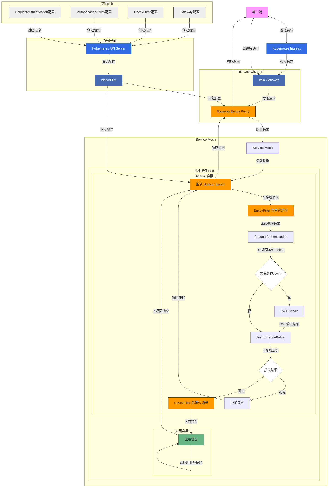

```mermaid
flowchart TD
    Client[客户端] -->|发送请求| Ingress[Kubernetes Ingress]
    Client -->|或直接访问| IstioGW[Istio Gateway]
    
    Ingress -->|转发请求| IstioGW
    
    subgraph "Istio Gateway Pod"
        IstioGW -->|传递请求| GatewayEnvoy[Gateway Envoy Proxy]
    end
    
    GatewayEnvoy -->|路由请求| ServiceMesh[Service Mesh]
    
    subgraph "Service Mesh"
        ServiceMesh -->|负载均衡| SvcEnvoy[服务 Sidecar Envoy]
        
        subgraph "目标服务 Pod"
            subgraph "Sidecar 容器"
                SvcEnvoy -->|1.接收请求| EnvoyPreFilters[EnvoyFilter 前置过滤器]
                EnvoyPreFilters -->|2.预处理请求| ReqAuth[RequestAuthentication]
                
                ReqAuth -->|3a.如有JWT Token| JwtVerify{需要验证JWT?}
                JwtVerify -->|是| JwtServer[JWT Server]
                JwtVerify -->|否| AuthPolicy[AuthorizationPolicy]
                JwtServer -->|JWT验证结果| AuthPolicy
                
                AuthPolicy -->|4.授权决策| AuthResult{授权结果}
                AuthResult -->|拒绝| Reject[拒绝请求]
                AuthResult -->|通过| EnvoyPostFilters[EnvoyFilter 后置过滤器]
                
            
            end
            subgraph "应用容器"
                EnvoyPostFilters -->|5.后处理| AppContainer[应用容器]
            end
            
            AppContainer -->|6.处理业务逻辑| AppContainer
            AppContainer -->|7.返回响应| SvcEnvoy
        end
    end
    
    subgraph "控制平面"
        IstiodPilot[Istiod/Pilot] -->|下发配置| GatewayEnvoy
        IstiodPilot -->|下发配置| SvcEnvoy
        APIServer[Kubernetes API Server] -->|资源配置| IstiodPilot
    end
    
    subgraph "资源配置"
        RequestAuthConfig[RequestAuthentication配置] -->|创建/更新| APIServer
        AuthPolicyConfig[AuthorizationPolicy配置] -->|创建/更新| APIServer
        EnvoyFilterConfig[EnvoyFilter配置] -->|创建/更新| APIServer
        GatewayConfig[Gateway配置] -->|创建/更新| APIServer
    end
    
    SvcEnvoy -->|响应返回| GatewayEnvoy
    GatewayEnvoy -->|响应返回| Client
    
    %% 错误处理路径
    Reject -->|返回错误| SvcEnvoy
    
    %% 附加说明
    classDef client fill:#f9f,stroke:#333,stroke-width:2px;
    classDef kubernetes fill:#326ce5,stroke:#fff,color:#fff;
    classDef istio fill:#466bb0,stroke:#fff,color:#fff;
    classDef envoy fill:#ff9900,stroke:#333,color:#333;
    classDef app fill:#68b684,stroke:#333,color:#333;
    classDef config fill:#eee,stroke:#333,color:#333;
    classDef decision fill:#fff,stroke:#333,color:#333,stroke-dasharray: 5 5;
    
    class Client client;
    class Ingress,APIServer kubernetes;
    class IstioGW,IstiodPilot istio;
    class GatewayEnvoy,SvcEnvoy,EnvoyPreFilters,EnvoyPostFilters envoy;
    class AppContainer app;
    class RequestAuthConfig,AuthPolicyConfig,EnvoyFilterConfig,GatewayConfig config;
    class JwtVerify,AuthResult decision;
```
