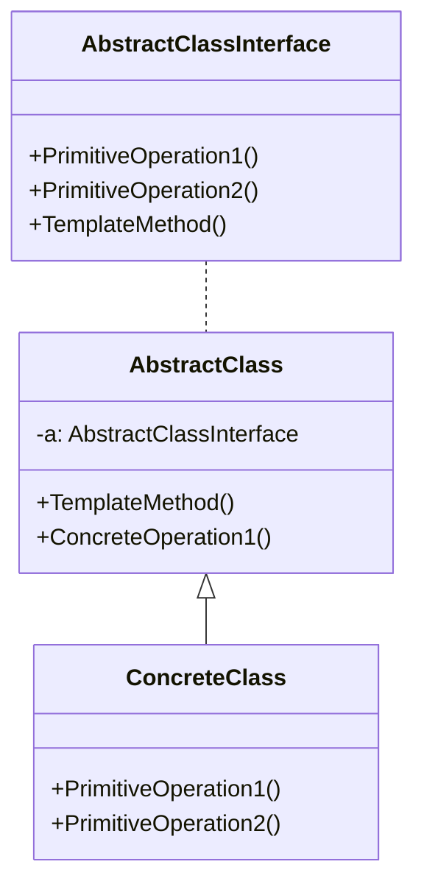

### 模板方法

##### 角色和职责

- **AbstractClass（抽象类）**
  
  - 定义了一系列基本操作(PrimitiveOperations)，具体、抽象均可
  
  - 基本操作与算法步骤一一对应，子类中可重定义或实现这些步骤
  
  - 实现一个模板方法(Template Method)，用于定义一个算法的框架
  
  - 模板方法可调用抽象类或子类实现的基本方法，还可调用其他对象方法
  
  - **go将抽象类拆分为接口、全局变量、模板类三部分**
    
    - 接口定义抽象函数
    
    - 局部变量定义模板（公共）属性
    
    - 模板类定义模板（公共）方法

- **ConcreteClass（具体子类）**
  
  - 是抽象类的子类，实现在父类中声明的抽象基本操作

##### 适用场景

- **稳定：算法骨架；变化：子类实现**

- (1) 具有统一的操作步骤或操作过程; 

- (2) 具有不同的操作细节;  

- (3) 存在多个具有同样操作步骤的应用场景，但某些具体的操作细节却各不相同;  

##### 类图



##### 实现

```go
// 抽象/接口类
type AbstractClass interface {
    PrimitiveOperation1()
    PrimitiveOperation2()
}
// 抽象/模板类
type Template struct {
    AbstractClass
}
func (a *Template) TemplateMethod() { // 抽象/模板类实现模板方法
    a.PrimitiveOperation1()
    a.PrimitiveOperation2()
    a.ConcreteOperation1()
}
func (a *Template) ConcreteOperation1() { // 抽象/模板类公共方法
    fmt.Println("模板类类公共方法1实现")
}
// 利用函数实现多态
func GetAbstractClass(a AbstractClass) *Template {
    return &Template{a}
}
// 具体类
type ConcreteClass struct {
}

func (c *ConcreteClass) PrimitiveOperation1() {
    fmt.Println("具体类方法1实现")
}
func (c *ConcreteClass) PrimitiveOperation2() {
    fmt.Println("具体类方法2实现")
}
func main() {
    var a *Template = GetAbstractClass(&ConcreteClass{})
    a.TemplateMethod()
}
```