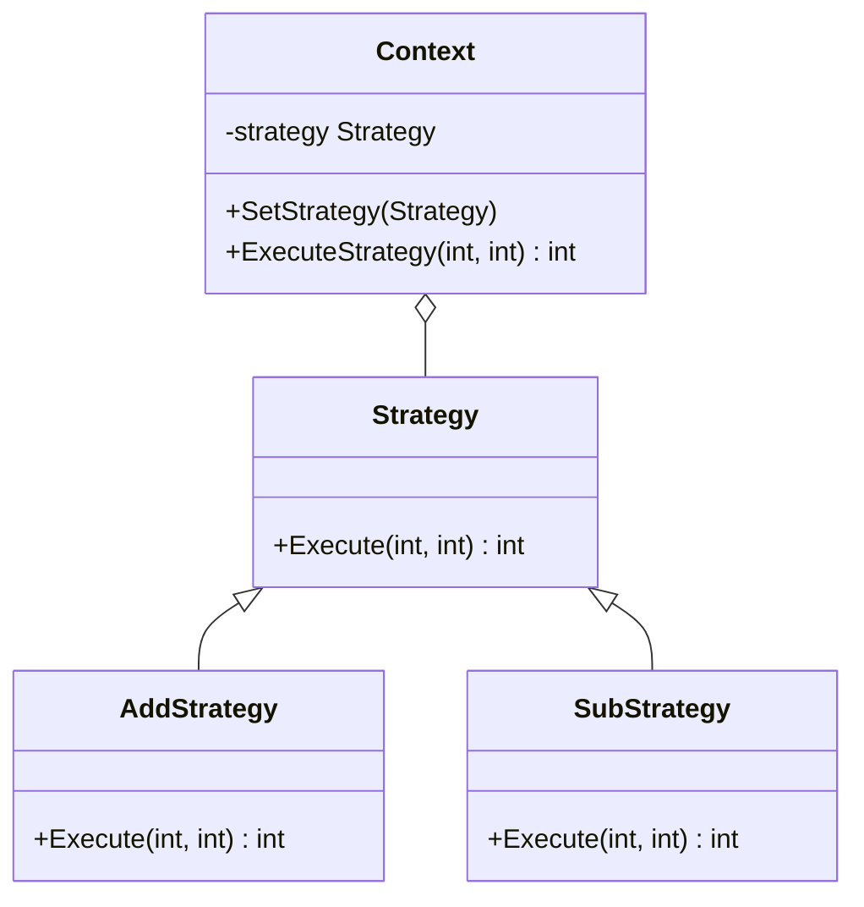

### 策略模式

##### 角色和职责

- **Context（环境类）**
  
  - 使用算法，解决问题时可采用多种策略
  
  - 维持一个对抽象策略类的引用实例

- **Strategy（抽象策略类）**
  
  - 为所支持的算法声明了抽象方法，可以是抽象类/具体类/接口
  
  - 环境类通过抽象策略类中声明的方法，在运行时调用具体策略类中实现的算法

- **ConcreteStrategy（具体策略类）**
  
  - 实现了在抽象策略类中声明的算法

##### 适用场景

- **稳定：使用算法的程序（环境类）；变化：算法（策略）**

- 将变化的算法封装成对象，使得它们可以互换。

##### 类图



##### 实现

```go
// 策略接口
type Strategy interface {
    Execute(int, int) int
}
// 加法策略
type AddStrategy struct{}
func (s AddStrategy) Execute(a, b int) int {
    return a + b
}
// 减法策略
type SubStrategy struct{}
func (s SubStrategy) Execute(a, b int) int {
    return a - b
}
// 环境类
type Context struct {
    strategy Strategy
}
func (c *Context) SetStrategy(strategy Strategy) {
    c.strategy = strategy
}
func (c Context) ExecuteStrategy(a, b int) int {
    return c.strategy.Execute(a, b)
}
func main() {
    // 创建环境类
    context := Context{}
    // 设置加法策略
    context.SetStrategy(AddStrategy{})
    fmt.Println("10 + 5 =", context.ExecuteStrategy(10, 5))
    // 设置减法策略
    context.SetStrategy(SubStrategy{})
    fmt.Println("10 - 5 =", context.ExecuteStrategy(10, 5))
}
```