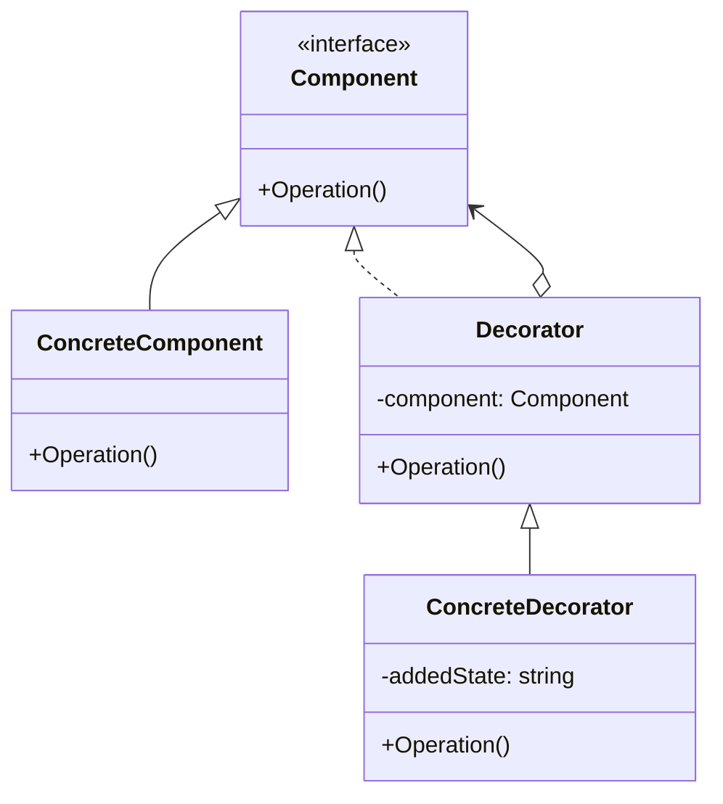

### 装饰器模式

##### 角色和职责

- **Component(抽象组件角色)**
  - 定义一个对象接口,可以给这些对象动态地添加职责
- **ConcreteComponent(具体组件角色)**
  - 实现了抽象组件角色所定义的接口
- **Decorator(抽象装饰角色)**
  - 持有一个组件对象的实例,并定义一个与抽象组件接口一致的接口
  - 可以增加自身的特定的责任
- **ConcreteDecorator(具体装饰角色)**
  - 具体装饰对象,负责给组件对象添加新的责任或职责

##### 适用场景

- **稳定：抽象组件/装饰器及其接口；变化：具体组件及装饰器**

- 避免过度的使用继承导致子类出现膨胀，解决主体类在多个方向的功能扩展——装饰

- 动态（组合）地给对象增加额外的职责，比生成子类（继承）更灵活

- 在接口上表现为is-a继承关系，在实现上表现为has-a的组合关系（特点）

##### 类图



##### 实现

```go
// 抽象构件
type Component interface {
    Operation() string
}

// 具体构件
type ConcreteComponent struct{}

func (c *ConcreteComponent) Operation() string {
    return "ConcreteComponent.Operation()"
}

// 抽象装饰角色
type Decorator struct {
    component Component
}

func (d *Decorator) Operation() string {
    return d.component.Operation()
}

// 具体装饰角色A
type ConcreteDecoratorA struct {
    *Decorator
}

func (d *ConcreteDecoratorA) Operation() string {
    return "ConcreteDecoratorA(" + d.Decorator.Operation() + ")"
}

// 具体装饰角色B
type ConcreteDecoratorB struct {
    *Decorator
    addedState string
}

func (d *ConcreteDecoratorB) Operation() string {
    return "ConcreteDecoratorB(" + d.addedState + "," + d.Decorator.Operation() + ")"
}

func main() {
    component := &ConcreteComponent{}
    decoratorA := &ConcreteDecoratorA{&Decorator{component}}
    decoratorB := &ConcreteDecoratorB{&Decorator{decoratorA}, "STATE"}

    println(component.Operation())       // ConcreteComponent.Operation()
    println(decoratorA.Operation())      // ConcreteDecoratorA(ConcreteComponent.Operation())
    println(decoratorB.Operation())      // ConcreteDecoratorB(STATE,ConcreteDecoratorA(ConcreteComponent.Operation()))
}
```
