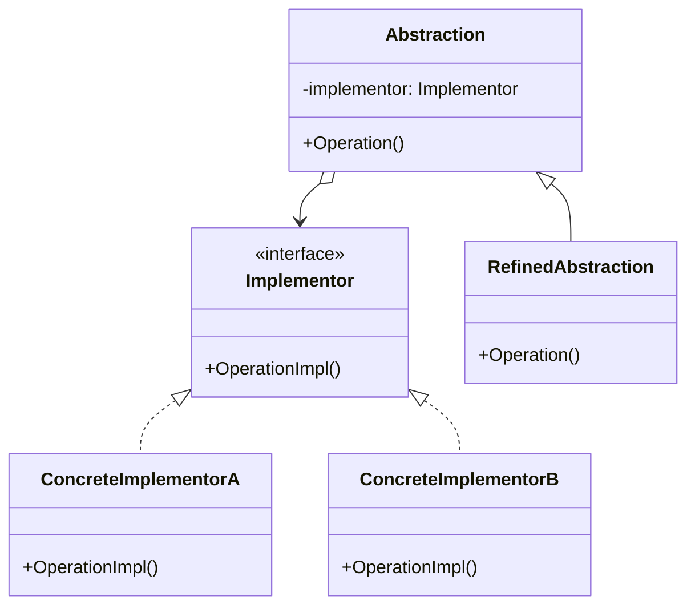

### 桥模式

##### 角色和职责

- **Abstraction(抽象类角色)**
  - 定义抽象类的接口,维护一个指向Implementor类的对象引用
- **RefinedAbstraction(扩充抽象类角色)**
  - 扩充由Abstraction定义的接口形式
- **Implementor(实现化角色)**
  - 声明一个基本操作的接口,这些基本操作的具体实现延迟到ConcreteImplementor中完成
- **ConcreteImplementor(具体实现化角色)**
  - 实现Implementor接口,提供基本操作的具体实现

##### 适用场景

- **稳定：抽象抽象类和抽象实现接口及组合/聚合；变化：扩充抽象类和具体实现**

- 接口和实现有两个/多个明显不同的变化维度，不引入额外复杂度

- 以组合取代继承，将抽象部分（业务功能）与实现部分（平台实现）分离以独立变化

- 类似多继承方案，但是多继承违背单一职责，复用性较差

- 例子：设计一个绘图程序,它可以绘制矩形和圆形,并且支持不同的渲染方式,如矢量渲染和光栅渲染。
  
  - 多继承：Rectangle、Circle继承 Shape 基类； VectorRenderer、RasterRenderer 继承 Renderer 基类
  
  - 桥模式：Shape是抽象类 Renderer 是抽象实现类

##### 类图



##### 实现

```go
// 实现者接口
type Implementor interface {
    OperationImpl() string
}

// 具体实现者A
type ConcreteImplementorA struct{}

func (c *ConcreteImplementorA) OperationImpl() string {
    return "ConcreteImplementorA Operation"
}

// 具体实现者B
type ConcreteImplementorB struct{}

func (c *ConcreteImplementorB) OperationImpl() string {
    return "ConcreteImplementorB Operation"
}

// 抽象化角色
type Abstraction struct {
    implementor Implementor
}

func (a *Abstraction) Operation() string {
    return a.implementor.OperationImpl()
}

// 扩充抽象化角色
type RefinedAbstraction struct {
    Abstraction
}

func (r *RefinedAbstraction) Operation() string {
    return "RefinedAbstraction " + r.Abstraction.Operation()
}

func main() {
    impl1 := &ConcreteImplementorA{}
    abstraction1 := &Abstraction{impl1}
    fmt.Println(abstraction1.Operation()) // ConcreteImplementorA Operation

    impl2 := &ConcreteImplementorB{} 
    abstraction2 := &RefinedAbstraction{Abstraction{impl2}}
    fmt.Println(abstraction2.Operation()) // RefinedAbstraction ConcreteImplementorB Operation
}
```
