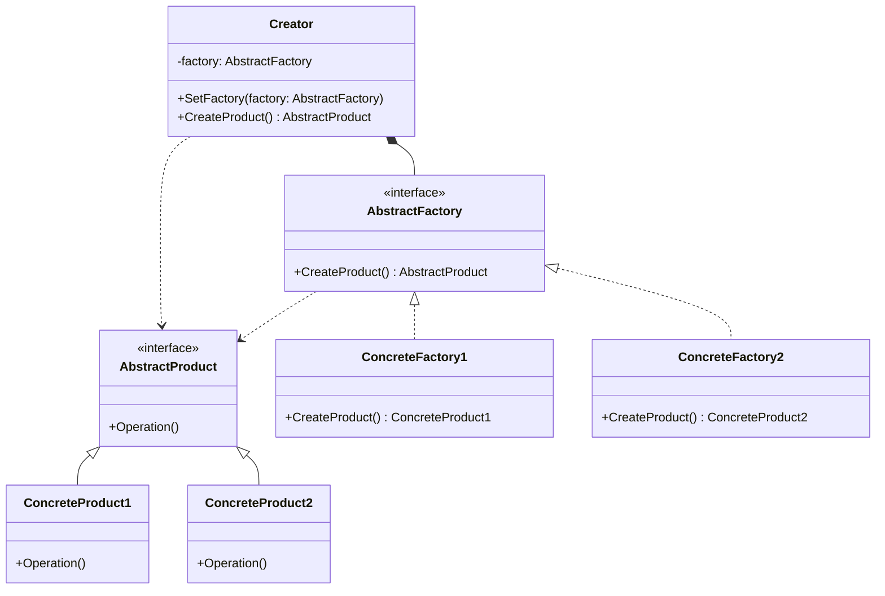

### 工厂模式

##### 角色和职责

- **Product(抽象产品角色)**
  - 定义了产品的规范,描述了产品的主要特性和功能
- **ConcreteProduct(具体产品角色)**
  - 实现了抽象产品角色所定义的接口,某种类型的具体产品对象
- **Factory(抽象工厂角色)**
  - declaration an interface for creating objects
- **ConcreteFactory(具体工厂角色)**
  - 实现了抽象工厂中定义的方法,包含具体创建产品实例的代码

##### 适用场景

- **稳定：抽象工厂、产品及具体工厂和产品的一一对应；变化：具体产品/工厂实现和数量**

- **场景：解决“单个对象”的需求变化，但创建方法/参数相同（new新对象时）**

- 一个具体工厂只生产一种具体产品（与抽象工厂模式的区别）

- 将创建(new)具体对象的工作延迟到子类，以隔离具体类型与使用者间的耦合

##### 类图



##### 实现

```go
// 抽象产品接口
type AbstractProduct interface {
    Operation()
}

// 具体产品A
type ConcreteProductA struct{}

func (p *ConcreteProductA) Operation() {
    fmt.Println("Product A operation")
}

// 具体产品B
type ConcreteProductB struct{}

func (p *ConcreteProductB) Operation() {
    fmt.Println("Product B operation")
}

// 抽象工厂接口
type AbstractFactory interface {
    CreateProduct() AbstractProduct
}

// 具体工厂A
type ConcreteFactoryA struct{}

func (f *ConcreteFactoryA) CreateProduct() AbstractProduct {
    return &ConcreteProductA{}
}

// 具体工厂B
type ConcreteFactoryB struct{}

func (f *ConcreteFactoryB) CreateProduct() AbstractProduct {
    return &ConcreteProductB{}
}

// 创建者
type Creator struct {
    factory AbstractFactory
}

func (c *Creator) SetFactory(factory AbstractFactory) {
    c.factory = factory
}

func (c *Creator) CreateProduct() AbstractProduct {
    return c.factory.CreateProduct()
}

func main() {
    creator := &Creator{}

    factoryA := &ConcreteFactoryA{}
    creator.SetFactory(factoryA)
    productA := creator.CreateProduct()
    productA.Operation() // Product A operation

    factoryB := &ConcreteFactoryB{}
    creator.SetFactory(factoryB)    
    productB := creator.CreateProduct()
    productB.Operation() // Product B operation
}
```
