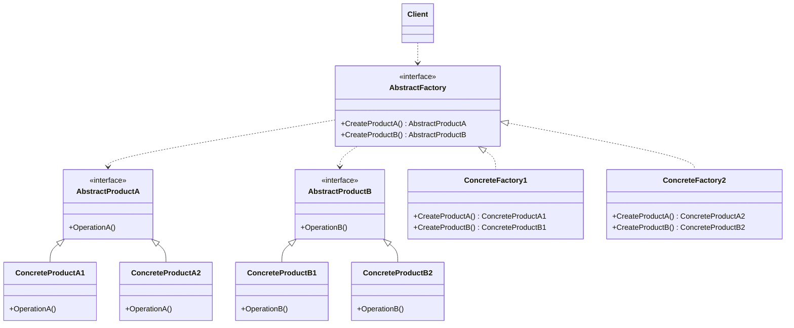

### 抽象工厂模式

##### 角色和职责

- **AbstractFactory(抽象工厂角色)**
  - 声明了一组用于创建一族产品对象的方法,每一个方法对应一种产品
- **ConcreteFactory(具体工厂角色)**
  - 实现了抽象工厂中定义的创建产品的方法,负责创建一族具体产品的实例
- **AbstractProduct(抽象产品角色)**
  - 为一族产品对象定义了相同的接口
- **ConcreteProduct(具体产品角色)**
  - 定义一个将被相应的具体工厂创建的产品对象
- **Client(客户端角色)**
  - 仅通过抽象工厂和抽象产品接口使用产品

##### 适用场景

- **稳定：抽象工厂、产品及具体工厂和产品的一一对应；变化：具体产品/工厂实现和数量**

- **场景：解决多个“系列对象”的需求变化，但创建方法/参数相同（new新系列时）**

- 一个具体工厂生产一系列具体产品，系列产品间相互依赖/耦合（与工厂模式的区别）

- 用于解决“新系列”的需求变动，但难以应对（系列内）“新对象”的的需求变动（如类图难以添加ProductC）

##### 类图



##### 实现

```go
// 抽象产品A接口
type AbstractProductA interface {
    OperationA()
}

// 具体产品A1
type ConcreteProductA1 struct{}

func (p *ConcreteProductA1) OperationA() {
    fmt.Println("Concrete Product A1 operation")
}

// 具体产品A2
type ConcreteProductA2 struct{}

func (p *ConcreteProductA2) OperationA() {
    fmt.Println("Concrete Product A2 operation")
}

// 抽象产品B接口
type AbstractProductB interface {
    OperationB()
}

// 具体产品B1
type ConcreteProductB1 struct{}

func (p *ConcreteProductB1) OperationB() {
    fmt.Println("Concrete Product B1 operation")
}

// 具体产品B2
type ConcreteProductB2 struct{}

func (p *ConcreteProductB2) OperationB() {
    fmt.Println("Concrete Product B2 operation")
}

// 抽象工厂接口
type AbstractFactory interface {
    CreateProductA() AbstractProductA
    CreateProductB() AbstractProductB
}

// 具体工厂1
type ConcreteFactory1 struct{}

func (f *ConcreteFactory1) CreateProductA() AbstractProductA {
    return &ConcreteProductA1{}
}

func (f *ConcreteFactory1) CreateProductB() AbstractProductB {
    return &ConcreteProductB1{}
}

// 具体工厂2
type ConcreteFactory2 struct{}

func (f *ConcreteFactory2) CreateProductA() AbstractProductA {
    return &ConcreteProductA2{}
}

func (f *ConcreteFactory2) CreateProductB() AbstractProductB {
    return &ConcreteProductB2{}
}

func main() {
    factory1 := &ConcreteFactory1{}
    productA1 := factory1.CreateProductA()
    productB1 := factory1.CreateProductB()
    productA1.OperationA() // Concrete Product A1 operation
    productB1.OperationB() // Concrete Product B1 operation

    factory2 := &ConcreteFactory2{}
    productA2 := factory2.CreateProductA()
    productB2 := factory2.CreateProductB()
    productA2.OperationA() // Concrete Product A2 operation
    productB2.OperationB() // Concrete Product B2 operation
}
```
