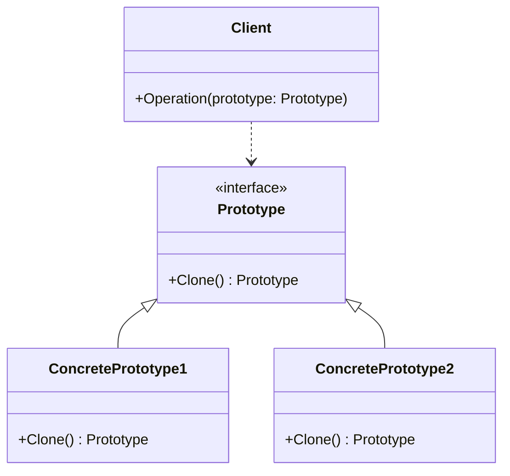

### 原型模式

##### 角色和职责

- **Prototype(抽象原型角色)**
  - 声明一个克隆自身的接口
- **ConcretePrototype(具体原型角色)**
  - 实现抽象原型角色所定义的接口,即实现克隆方法
- **Client(客户端角色)**
  - 在客户端代码中调用原型对象的克隆方法创建新的对象

##### 适用场景

- **稳定：抽象原型和Clone接口；变化：具体原型实现/数量**

- 深拷贝原型实例来创建新对象，可以像备忘录模式一样使用序列化实现

- 用于结构复杂且需要配置大量状态（参数），或初始状态不如中间状态实用（如gin.Context.Request.Header/Body）

- 隔离实用使用者（Client）和具体类型（易变类）之间的耦合，但要求易变类具有稳定接口

##### 类图



##### 实现

```go
// 抽象原型接口
type Prototype interface {
    Clone() Prototype
}

// 具体原型1
type ConcretePrototype1 struct {
    filed1 string
}

func (c *ConcretePrototype1) Clone() Prototype {
    return &ConcretePrototype1{
        filed1: c.filed1,
    }
}

// 具体原型2 
type ConcretePrototype2 struct {
    filed1 int
    filed2 string
}

func (c *ConcretePrototype2) Clone() Prototype {
    return &ConcretePrototype2{
        filed1: c.filed1,
        filed2: c.filed2,
    }
}

// 客户端
func Operation(proto Prototype) {
    clonedObj := proto.Clone()
    // 使用克隆对象进行操作
    // ...
}

func main() {
    proto1 := &ConcretePrototype1{filed1: "foo"}
    Operation(proto1)

    proto2 := &ConcretePrototype2{filed1: 123, filed2: "bar"}
    Operation(proto2)
}
```
