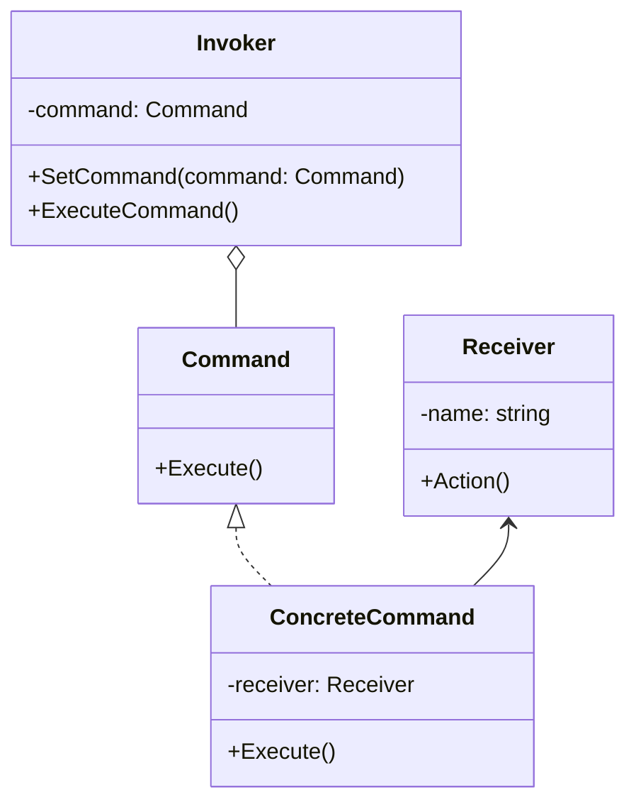

### 建造者模式

##### 角色和职责

- **Product(产品角色)**
  - 产品的抽象类,包含产品的抽象组成部分,提供组建产品的基本接口
- **ConcreteProduct(具体产品角色)**
  - 实现抽象产品角色所定义的接口,是产品的具体实现
- **Builder(抽象建造者角色)**
  - 定义一个产品构建的抽象接口,规范产品的组建过程
  - 通常是一个抽象类,并定义产品的构建步骤
- **ConcreteBuilder(具体建造者角色)**
  - 实现了Builder的接口,构建和装配具体产品
  - 定义和描述了产品实例的装配过程
- **Director(指挥者角色)**
  - 构造产品的过程控制器,调用Builder中相关的构造方法完成复杂对象的构造
  - 不直接涉及产品的具体构造过程

##### 适用场景

- 稳定：调用者命令接收者的关系；变化：命令/行为及与其绑定的接受者的数量与实现

- 对行为进行“记录（行为日志）、撤销/重做、事务、排队、定时”等处理

- 复合命令：通过组合模式将多个命令/行为封装为复合命令

- 将行为（请求）封装/抽象为对象，将行为调用者与接收者解耦

##### 类图



##### 实现

```go
// 命令接口
type Command interface {
    Execute()
}
// 接收者
type Receiver struct {
    Name string
}
func (r *Receiver) Action() {
    fmt.Printf("%s执行了操作\n", r.Name)
}
// 具体命令
type ConcreteCommand struct {
    receiver *Receiver
}
func (c *ConcreteCommand) Execute() {
    c.receiver.Action()
}
// 调用者
type Invoker struct {
    command Command
}
func (i *Invoker) SetCommand(command Command) {
    i.command = command
}
func (i *Invoker) ExecuteCommand() {
    i.command.Execute()
}

func main() {
    // 创建接收者
    receiver := &Receiver{Name: "接收者"}
    // 创建具体命令并指定接收者
    command := &ConcreteCommand{receiver: receiver}
    // 创建调用者并设置命令
    invoker := &Invoker{}
    invoker.SetCommand(command)
    // 调用者执行命令
    invoker.ExecuteCommand()
}
```
