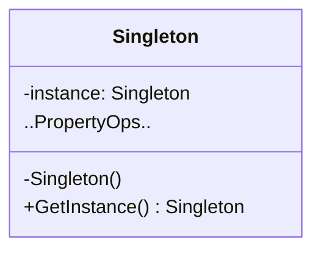

### 单例模式

##### 角色和职责

- **Singleton(单例类)**
  - 定义一个获取自身实例的静态方法
  - 对外提供自身唯一实例进行访问
  - 确保只有一个实例被创建

##### 适用场景

- **稳定：不涉及；变化：不涉及**

- 注意线程安全

##### 类图



##### 实现

```go
// 单例类
type Singleton struct {
    // 其他属性和方法...
}

// 私有的单例实例
var instance *Singleton

func GetInstance() *Singleton {
    if instance == nil {
        instance = &Singleton{}
        // 初始化实例...
    }
    return instance
}

func main() {
    s1 := GetInstance()
    s2 := GetInstance()

    // s1 和 s2 是同一个实例
}

// ====================  线程安全的单例模式  =====================
var instance *Singleton
var once sync.Once

func GetInstance() *Singleton {
    once.Do(func() {
        instance = &Singleton{}
        // 初始化实例...
    })
    return instance
}
```
