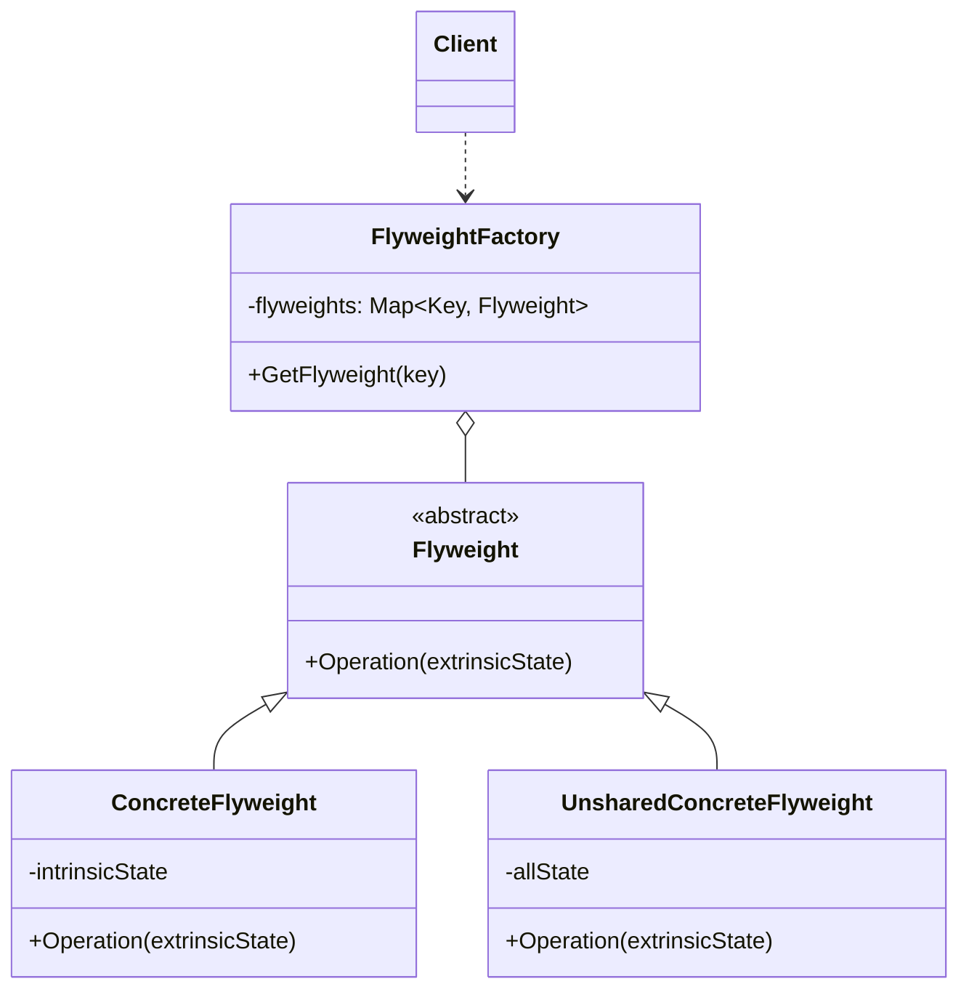

### 中介者模式

##### 角色和职责

- **Flyweight(抽象享元类)**
  - 声明一个实例化为具体享元类对象所需的数据
  - 为外部状态提供存储空间
- **ConcreteFlyweight(具体享元类)**
  - 实现抽象享元类,为内部状态提供存储空间
- **UnsharedConcreteFlyweight(非共享具体享元类)**
  - 不与其他实例共享实例,因为实例无法区分为内部或外部状态
- **FlyweightFactory(享元工厂类)**
  - 创建并管理享元对象,确保合理地共享享元,当用户请求时,享元工厂对象提供一个存在的实例或构造一个新的实例

##### 适用场景

- **稳定：不涉及；变化：不涉及**

- 运用共享技术有效地支持大量细粒度对象

- Flyweight主要解决面向对象的代价问题，而不触及面向对象的抽象问题

- 通过共享的做法来降低系统中对象的个数，从而降低细粒度对对象系统带来的内存压力（注意对象状态的处理）

##### 类图



##### 实现

```go
// 抽象享元
type Flyweight interface {
    Operation(extrinsicState string)
}

// 具体享元
type ConcreteFlyweight struct {
    intrinsicState string
}

func (c *ConcreteFlyweight) Operation(extrinsicState string) {
    fmt.Printf("Object: %s, ExtrinsicState: %s\n", c.intrinsicState, extrinsicState)
}

// 非共享具体享元
type UnsharedConcreteFlyweight struct {
    allState string
}

func (u *UnsharedConcreteFlyweight) Operation(extrinsicState string) {
    fmt.Printf("Object: %s, ExtrinsicState: %s\n", u.allState, extrinsicState)
}

// 享元工厂
type FlyweightFactory struct {
    flyweights map[string]Flyweight
}

func (f *FlyweightFactory) GetFlyweight(state string) Flyweight {
    if flyweight, ok := f.flyweights[state]; ok {
        return flyweight
    } else {
        flyweight := &ConcreteFlyweight{intrinsicState: state}
        f.flyweights[state] = flyweight
        return flyweight
    }
}

func main() {
    factory := &FlyweightFactory{
        flyweights: make(map[string]Flyweight),
    }

    flyweight1 := factory.GetFlyweight("Intrinsic State 1")
    flyweight1.Operation("Extrinsic State 1")

    flyweight2 := factory.GetFlyweight("Intrinsic State 2")
    flyweight2.Operation("Extrinsic State 2")

    flyweight3 := factory.GetFlyweight("Intrinsic State 1")
    flyweight3.Operation("Extrinsic State 3")

    unsharedFlyweight := &UnsharedConcreteFlyweight{
        allState: "Unshared Flyweight State",
    }
    unsharedFlyweight.Operation("Extrinsic State 4")
}
```
