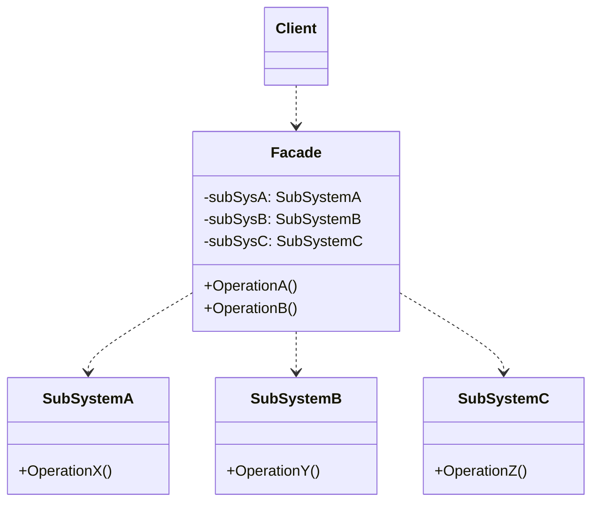

### 门面模式（架构）

##### 角色和职责

- **Facade(外观类)**
  - 知道哪些子系统类负责处理请求
  - 将客户的请求代理给适当的子系统对象
- **SubSystem(子系统类)**
  - 实现系统的部分功能,处理由Facade对象指派的功能
  - 没有Facade的相互作用,仅向Facade对象遮曾它的功能和方法

##### 适用场景

- **稳定：Facade接口；变化：Subsystem的数量及实现**

- 简化了整个组件系统的接口，实现组件内部与客户程序的解耦

- 从架构层面而非单个类的层面，更多的是一种架构设计模式

- 门面模式中组件内部应该是相互耦合关系比较大的一系列组件

##### 类图



##### 实现

```go
// 子系统A
type SubSystemA struct{}

func (s *SubSystemA) OperationX() {
    fmt.Println("SubSystem A: Operation X")
}

// 子系统B
type SubSystemB struct{}

func (s *SubSystemB) OperationY() {
    fmt.Println("SubSystem B: Operation Y")
}

// 子系统C
type SubSystemC struct{}

func (s *SubSystemC) OperationZ() {
    fmt.Println("SubSystem C: Operation Z")
}

// 门面
type Facade struct {
    subSysA *SubSystemA
    subSysB *SubSystemB
    subSysC *SubSystemC
}

func (f *Facade) OperationA() {
    f.subSysA.OperationX()
    f.subSysB.OperationY()
}

func (f *Facade) OperationB() {
    f.subSysB.OperationY()
    f.subSysC.OperationZ()
}

func main() {
    facade := &Facade{
        subSysA: &SubSystemA{},
        subSysB: &SubSystemB{},
        subSysC: &SubSystemC{},
    }

    facade.OperationA()
    fmt.Println()
    facade.OperationB()
}
```
