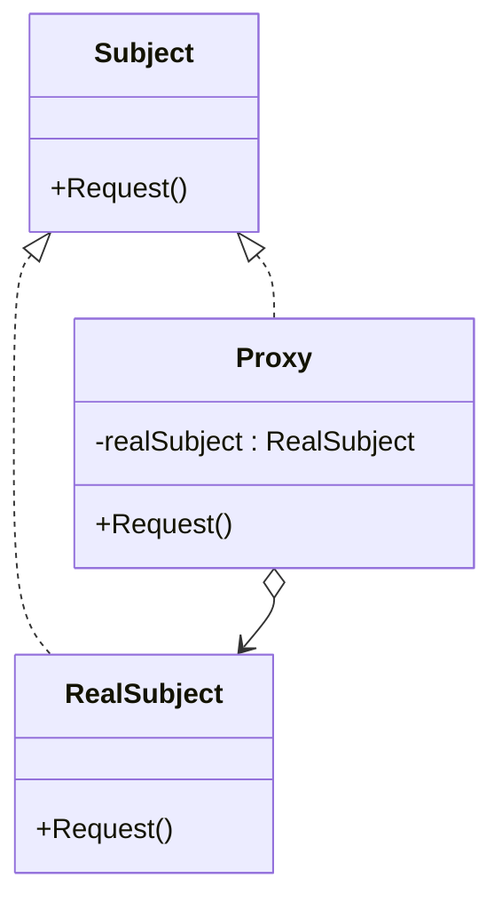

### 代理模式

##### 角色和职责

- **Subject(抽象主体角色)**
  - 声明真实主体和代理对象的共同接口
  - 这是代理模式的核心,它使代理角色和真实主题角色具有相同的接口,这使得它们在任何使用环境下可以相互替代
- **RealSubject(真实主体角色)**
  - 实现抽象主体中的具体业务,是代理对象所代表的真实实体,是最终要引用的对象
- **Proxy(代理角色)**
  - 提供了与真实主题相同的接口,其内部含有对真实主体的引用,它可以访问、控制或扩展真实主体的功能

##### 适用场景

- **稳定：代理及对象有相同接口（未必完全一致）；变化：代理与具体对象的实现（差异很大）**

- 由于对象创建开销大、安全控制、进程外访问/无法直接访问等原因增加间接控制层；

- 远程代理(Remote Proxy)为一个对象在不同的地址空间提供局部代表,可以隐藏一个对象存在于不同地址空间的事实

- 虚拟代理(Virtual Proxy)根据需要创建开销很大的对象,直到真正需要它们的时候

- 保护代理(Protection Proxy)可以控制对一个对象的访问,适合对象应该有不同的访问权限时使用

- 智能引用代理(Smart Reference Proxy)当一个对象被引用时,提供一些额外的服务,比如将对对象的引用存入一个计数器中

##### 类图



##### 实现

```go
// 抽象主体接口
type Subject interface {
    Request()
}

// 真实主体
type RealSubject struct {}

func (r *RealSubject) Request() {
    fmt.Println("Access real subject")
}

// 代理
type Proxy struct {
    real *RealSubject
}

func (p *Proxy) Request() {
    // 在这里可以执行相关的访问控制
    if /* 权限检查通过 */ {
        p.real = new(RealSubject)
        p.real.Request()
    } else {
        fmt.Println("Access denied")
    }
}

func main() {
    proxy := &Proxy{}
    proxy.Request()
}
```
