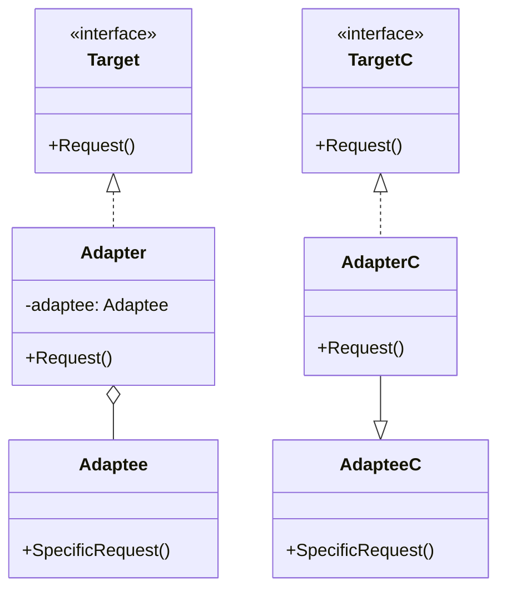

### 适配器模式

##### 角色和职责

- **Target(目标抽象类)**
  - 定义了客户端使用的接口,可以是抽象类或接口
- **Adaptee(适配者类)**
  - 是被适配的角色,它是已经存在的一个接口或类,但是它的接口不符合客户端的需求
- **Adapter(适配器类)**
  - 对Adaptee的接口与Target接口进行适配,它通过**继承或组合**的方式,把Adaptee的接口包裹在Target接口里

##### 适用场景

- **稳定：Adaptee(适配者类)和Target(目标抽象类)；变化：Adapter(适配器类)**

- 用于希望复用现存的类但接口又与服用环境要求不一致

- 存在两种实现：对象适配器（对象组合）和类适配器（多继承，不推荐）

- 实现灵活，可以将现存Adaptee(适配者类)作为新接口的参数来适配

##### 类图



##### 实现

```go
// 对象适配器
// 目标接口
type Target interface {
    Request()
}

// 适配者(已存在的类)
type Adaptee struct{}

func (a *Adaptee) SpecificRequest() {
    fmt.Println("Adaptee: Specific Request")
}

// 适配器
type Adapter struct {
    adaptee *Adaptee
}

func (a *Adapter) Request() {
    a.adaptee.SpecificRequest()
}

func main() {
    adaptee := &Adaptee{}
    adapter := &Adapter{adaptee: adaptee}

    var target Target = adapter
    target.Request()
}
```
