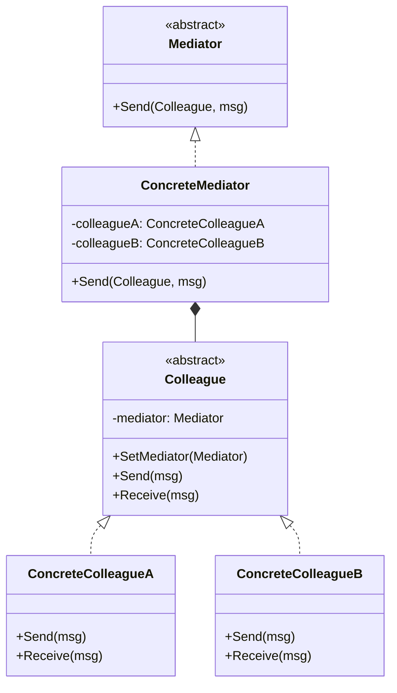

### 中介者模式

##### 角色和职责

- **Mediator(抽象中介者)**
  - 定义了同事对象到中介者对象的接口,用于与其他同事对象进行通信
- **ConcreteMediator(具体中介者)**
  - 实现抽象中介者接口,定义一个或多个同事对象
  - 知道所有具体同事类,并维护当前高层控制逻辑
  - 从具体同事对象接收通知,并向其他同事对象进行转发
- **Colleague(抽象同事类)**
  - 定义个同事类所具有的接口,保存当前中介者对象,用于与其它同事对象通信
- **ConcreteColleague(具体同事类)**
  - 实现在抽象同事类中定义的接口

##### 适用场景

- **稳定：抽象中介者、抽象同事类及具体中介者关联具体同事类；变化：具体中介者和具体同事类的实现**

- 用一个中介者来封装一系列的对象交互，使同事类间由编译时依赖变为运行时依赖

- 将多个对象间的控制逻辑进行集中管理

- 随着控制逻辑复杂化，中介者实现可能会相当复杂，此时可对中介者进行分解

- 门面模式是解耦系统间（单向）对象关联关系，中介者模式解耦系统间（双向）...

##### 类图



##### 实现

```go
// 中介者接口
type Mediator interface {
    Send(Colleague, string)
}

// 具体中介者
type ConcreteMediator struct {
    colleagueA *ConcreteColleagueA
    colleagueB *ConcreteColleagueB
}

func (m *ConcreteMediator) Send(c Colleague, msg string) {
    if c == m.colleagueA {
        m.colleagueB.Receive(msg)
    } else {
        m.colleagueA.Receive(msg)
    }
}

// 抽象同事类
type Colleague interface {
    SetMediator(Mediator)
    Send(string)
    Receive(string)
}

// 具体同事类A
type ConcreteColleagueA struct {
    mediator Mediator
}

func (c *ConcreteColleagueA) SetMediator(m Mediator) {
    c.mediator = m
}

func (c *ConcreteColleagueA) Send(msg string) {
    c.mediator.Send(c, msg)
}

func (c *ConcreteColleagueA) Receive(msg string) {
    fmt.Printf("Colleague A received: %s\n", msg)
}

// 具体同事类B
type ConcreteColleagueB struct {
    mediator Mediator
}

func (c *ConcreteColleagueB) SetMediator(m Mediator) {
    c.mediator = m
}

func (c *ConcreteColleagueB) Send(msg string) {
    c.mediator.Send(c, msg)
}

func (c *ConcreteColleagueB) Receive(msg string) {
    fmt.Printf("Colleague B received: %s\n", msg)
}

func main() {
    mediator := &ConcreteMediator{}

    colleagueA := &ConcreteColleagueA{}
    colleagueB := &ConcreteColleagueB{}

    mediator.colleagueA = colleagueA
    mediator.colleagueB = colleagueB

    colleagueA.SetMediator(mediator)
    colleagueB.SetMediator(mediator)

    colleagueA.Send("Hello from A")
    colleagueB.Send("Hi from B")
}
```
