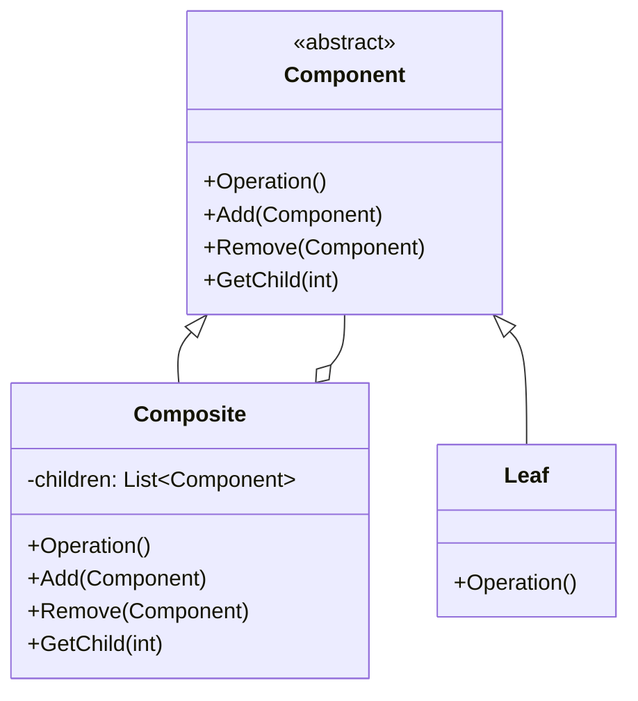

### 组合模式

##### 角色和职责

- **Component(抽象构件)**
  - 定义了叶子和容器构件的共有方法和属性
  - 可以定义默认行为或通过子类方式实现共有行为
- **Leaf(叶子构件)**
  - 没有子构件,实现了在抽象构件中定义的行为
- **Composite(容器构件)**
  - 包含0个或多个子构件
  - 实现了在抽象构件中定义的关于子构件的操作,如添加和删除

##### 适用场景

- **稳定：对单个对象和多个对象的使用/调用；变化：对象的结构**

- 将对象组合成树形结构以表示“部分-整体”的层次结构（树结构）

- 用户对单个对象和组合对象的使用具有一致性（与迭代器区别）

- 用于将“一对多”的关系变为“一对一”的关系

- 用户仅对接口/方法依赖，与对象内部结构解耦

##### 类图



##### 实现

```go
// 抽象构件
type Component interface {
    Operation() 
    Add(Component)
    Remove(Component)
    GetChild(int) Component
}

// 叶子构件
type Leaf struct {
    name string
}

func (l *Leaf) Operation() {
    fmt.Printf("%s: Leaf Operation\n", l.name)
}

func (l *Leaf) Add(c Component) {
    // 叶子节点没有Add操作
}

func (l *Leaf) Remove(c Component) {
    // 叶子节点没有Remove操作
}

func (l *Leaf) GetChild(i int) Component {
    return nil
}

// 容器构件
type Composite struct {
    name      string
    children  []Component
}

func (c *Composite) Operation() {
    fmt.Printf("%s: Composite Operation\n", c.name)
    for _, child := range c.children {
        child.Operation()
    }
}

func (c *Composite) Add(component Component) {
    c.children = append(c.children, component)
}

func (c *Composite) Remove(component Component) {
    for i, child := range c.children {
        if child == component {
            c.children = append(c.children[:i], c.children[i+1:]...)
            return
        }
    }
}

func (c *Composite) GetChild(i int) Component {
    if i < 0 || i >= len(c.children) {
        return nil
    }
    return c.children[i]
}

func main() {
    // 创建叶子构件
    leaf1 := &Leaf{name: "Leaf1"}
    leaf2 := &Leaf{name: "Leaf2"}

    // 创建容器构件
    composite1 := &Composite{name: "Composite1"}
    composite2 := &Composite{name: "Composite2"}

    // 添加叶子构件到容器构件
    composite1.Add(leaf1)
    composite2.Add(leaf2)
    composite1.Add(composite2)

    // 执行操作
    composite1.Operation()
}
```
