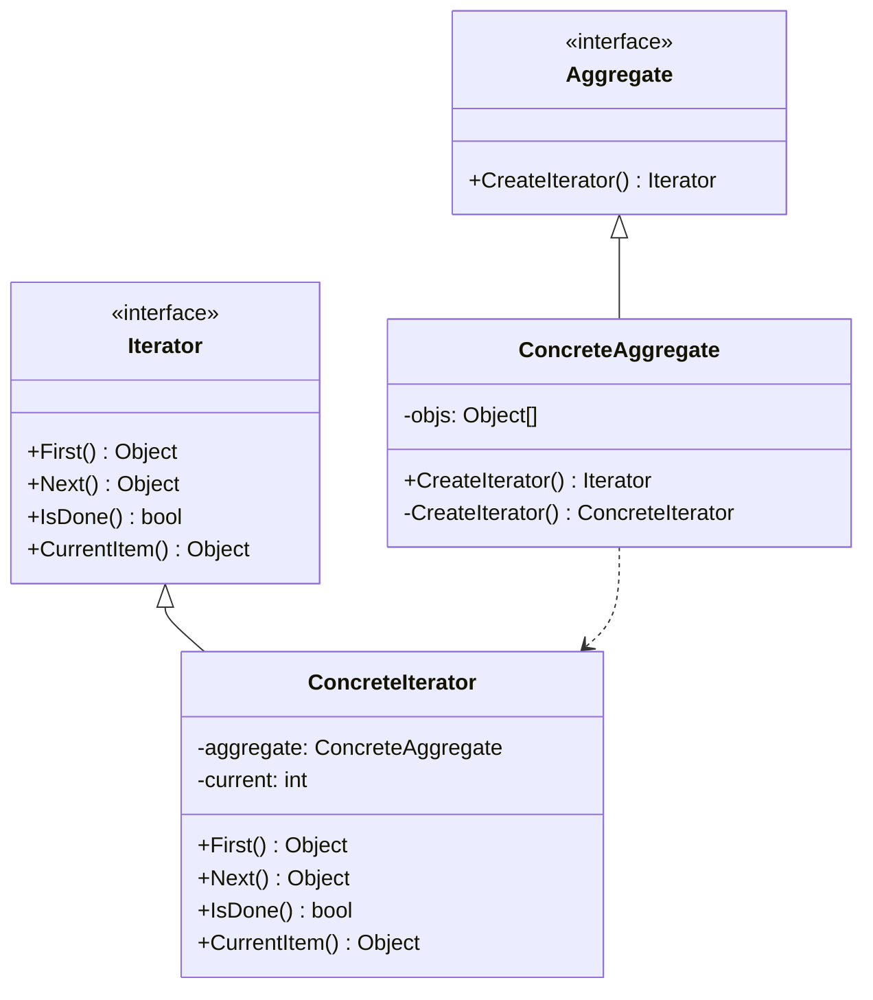

### 迭代器模式

##### 角色和职责

- **Iterator(抽象迭代器)**
  - 定义了遍历容器所需的接口,如首元素、下一个、是否有下一个等
- **ConcreteIterator(具体迭代器)**
  - 实现了迭代器接口,对容器内部的遍历逻辑
- **Aggregate(抽象容器)**
  - 定义获取迭代器对象的接口,为应用层提供无需了解底层的遍历方式
- **ConcreteAggregate(具体容器)**
  - 实现了容器的相关接口,并保存相关的迭代器实例

##### 适用场景

- **稳定：遍历接口；变化：集合中元素的结构和实现**

- 提供方法，顺序访问聚合对象中各个元素，不暴露对象内部表示（链表结构）

- 封装统一接口，使同样的算法在不同集合上进行操作（与组合模式区别）

- 健壮性：遍历的同时更改集合结构会导致问题

##### 类图



##### 实现

```go
// 抽象容器
type Aggregate interface {
    CreateIterator() Iterator
}

// 具体容器
type ConcreteAggregate struct {
    items []string
}

func (c *ConcreteAggregate) CreateIterator() Iterator {
    return &ConcreteIterator{
        items:   c.items,
        current: 0,
    }
}

// 抽象迭代器 
type Iterator interface {
    First() interface{}
    Next() interface{}
    IsDone() bool
    CurrentItem() interface{}
}

// 具体迭代器
type ConcreteIterator struct {
    items   []string
    current int
}

func (i *ConcreteIterator) First() interface{} {
    return i.items[0]
}

func (i *ConcreteIterator) Next() interface{} {
    i.current++
    if i.current >= len(i.items) {
        return nil
    }
    return i.items[i.current]
}

func (i *ConcreteIterator) IsDone() bool {
    return i.current >= len(i.items)
}

func (i *ConcreteIterator) CurrentItem() interface{} {
    return i.items[i.current]
}

func main() {
    aggregate := &ConcreteAggregate{
        items: []string{"A", "B", "C", "D", "E"},
    }
    iterator := aggregate.CreateIterator()

    for !iterator.IsDone() {
        fmt.Println(iterator.CurrentItem())
        iterator.Next()
    }
}
```
