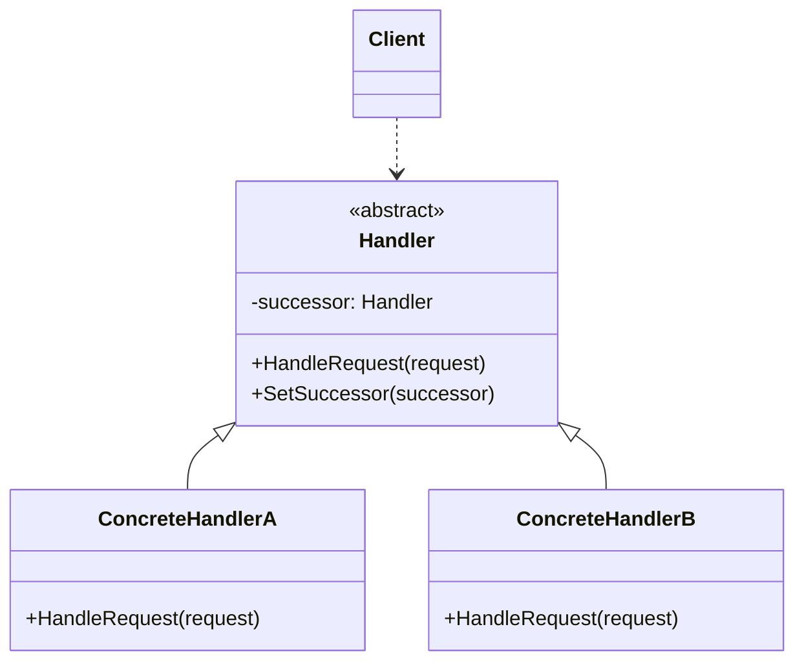

### 职责链模式

##### 角色和职责

- **Handler(抽象处理者)**
  - 定义一个处理请求的接口
  - 实现链中的后继链接,或设计为抽象类,默认实现successor()
- **ConcreteHandler(具体处理者)**
  - 实现抽象处理者的处理方法,判断自己是否有相应的处理权责
  - 如果可以处理,则处理请求,否则将请求传递给链中的后继者
- **Client(请求者)**
  - 向链中的某一个处理者对象提交请求

##### 适用场景

- **稳定：链式调用接口；变化：职责链中的处理者数量、顺序及实现**

- 多个处理者处理同一类请求,但哪个处理者处理则在运行时动态决定

- 将处理者连成一条链，并沿着链传递请求直至有对象处理

- 解除发送者-接受者耦合关系

- 处理者职责分派更灵活，可以动态新增/移除请求处理者、

- 健壮性： 如果末尾依旧得不到处理应用有一个缺省机制

##### 类图



##### 实现

```go
// 抽象处理者
type Handler interface {
    SetSuccessor(Handler)
    HandleRequest(int) 
}

// 具体处理者A
type HandlerA struct {
    successor Handler
}

func (h *HandlerA) SetSuccessor(successor Handler) {
    h.successor = successor
}

func (h *HandlerA) HandleRequest(request int) {
    if request >= 0 && request < 10 {
        fmt.Printf("HandlerA 处理请求 %d\n", request)
    } else if h.successor != nil {
        h.successor.HandleRequest(request)
    }
}

// 具体处理者B
type HandlerB struct {
    successor Handler  
}

func (h *HandlerB) SetSuccessor(successor Handler) {
    h.successor = successor
}

func (h *HandlerB) HandleRequest(request int) {
    if request >= 10 && request < 20 {
        fmt.Printf("HandlerB 处理请求 %d\n", request)
    } else if h.successor != nil {
        h.successor.HandleRequest(request)
    }
}

func main() {
    handlerA := &HandlerA{}
    handlerB := &HandlerB{}

    handlerA.SetSuccessor(handlerB)

    requests := []int{5, 14, 22, 3, 18}
    for _, req := range requests {
        handlerA.HandleRequest(req)
    }
}
```
