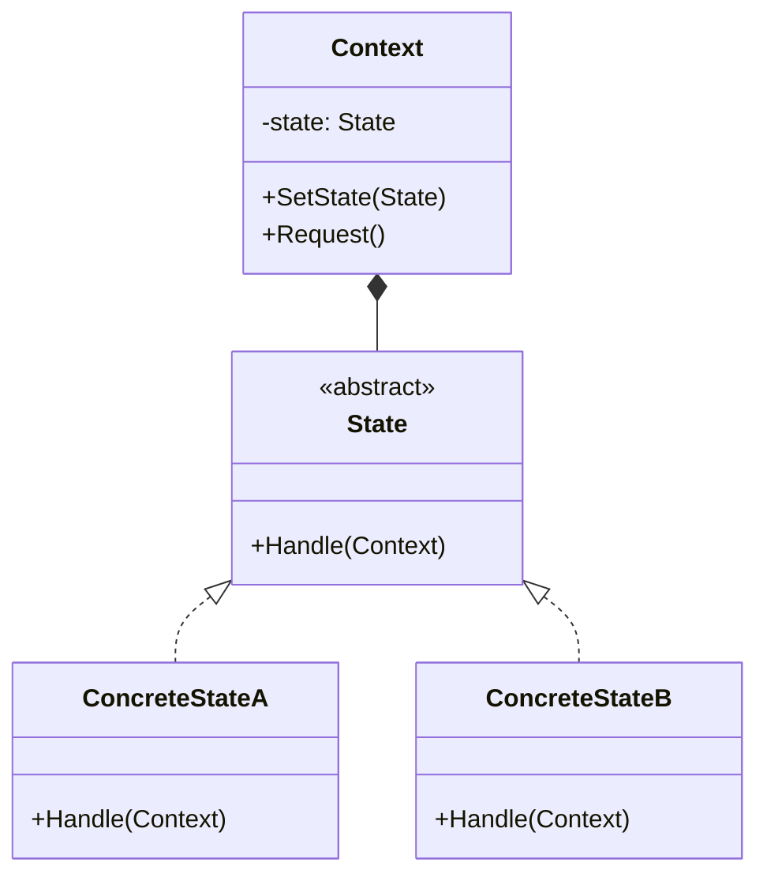

### 状态模式

##### 角色和职责

- **State(抽象状态类)**
  - 定义一个接口以封装与Context的一个特定状态相关的行为
- **ConcreteState(具体状态类)**
  - 实现抽象状态类所定义的接口
  - 每一个子类实现一个与Context的一个状态相关的行为
- **Context(环境类)**
  - 因为golang抽象状态接口中不能存放成员变量而存在
  - 定义客户感兴趣的接口,并维护一个具体状态实例的引用
  - 可将与状态相关的操作委托给当前的ConcreteState对象处理

##### 适用场景

- **稳定：状态的操作数量（抽象状态、环境类）；变化：状态的数量/实现**

- 与策略模式非常相似，状态模式在于状态间的切换，策略模式在于策略间的替换

- 将所有与特定状态相关的行为都放入State接口，状态切换时切换具体State对象，但State接口不变，实现操作与状态转换间得解耦；

- 原子性：不同状态即不同对象，不会出现状态不一致；

- 如果State对象没有实例变量，多个上下文可以共享同一个State对象

##### 类图



##### 实现

```go
// 状态接口
type State interface {
    Handle(ctx *Context)
}

// 具体状态A
type ConcreteStateA struct{}

func (s *ConcreteStateA) Handle(ctx *Context) {
    fmt.Println("State A handles the request.")
    ctx.state = &ConcreteStateB{}
}

// 具体状态B
type ConcreteStateB struct{}

func (s *ConcreteStateB) Handle(ctx *Context) {
    fmt.Println("State B handles the request.")
    ctx.state = &ConcreteStateA{}
}

// Context
type Context struct {
    state State
}

// 如果有多个handle时如何处理？定义多个Request？
func (c *Context) Request() {
    c.state.Handle(c)
}

func main() {
    ctx := &Context{state: &ConcreteStateA{}}

    ctx.Request()
    ctx.Request()
    ctx.Request()
}
```
