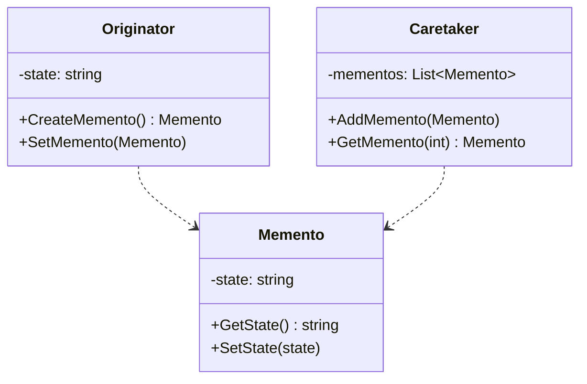

### 备忘录模式

##### 角色和职责

- **Originator(发起人/原发器)**
  - 创建一个备忘录,用来记录当前时刻它的内部状态
  - 使用备忘录恢复内部状态
- **Memento(备忘录)**
  - 存储发起人对象的内部状态,在需要时恢复发起人对象的内部状态
  - 防止发起人以外的对象访问备忘录的数据
- **Caretaker(管理者)（可选）**
  - 管理备忘录对象,可以存储/获取备忘录,在需要时决定恢复发起人的哪一个状态

##### 适用场景

- **稳定：原发器对外隐藏实现；变化：备忘录的实现（如序列化方案）**

- Memento（备忘录）保存Originator（原发器）对象内部状态，在需要时恢复

- 核心是Originator（原发器）对外隐藏信息保持封装性，又要保存状态到外界(Memento)

- 通常采用序列化方案来实现备忘录模式

##### 类图



##### 实现

```go
// 发起人/原发器
type Originator struct {
    state string
}

func (o *Originator) CreateMemento() *Memento {
    return &Memento{state: o.state}
}

func (o *Originator) SetMemento(m *Memento) {
    o.state = m.GetState()
}

func (o *Originator) SetState(state string) {
    o.state = state
}

func (o *Originator) GetState() string {
    return o.state
}

// 备忘录
type Memento struct {
    state string
}

func (m *Memento) GetState() string {
    return m.state  
}

func (m *Memento) SetState(state string) {
    m.state = state
}

// 管理者 
type Caretaker struct {
    mementos []*Memento
}

func (c *Caretaker) AddMemento(m *Memento) {
    c.mementos = append(c.mementos, m)
}

func (c *Caretaker) GetMemento(index int) *Memento {
    if index < 0 || index >= len(c.mementos) {
        return nil
    }
    return c.mementos[index]
}

func main() {
    originator := &Originator{state: "State1"}
    caretaker := &Caretaker{}

    // 保存状态到备忘录
    caretaker.AddMemento(originator.CreateMemento())

    // 修改状态
    originator.SetState("State2")
    caretaker.AddMemento(originator.CreateMemento())

    // 恢复到之前的状态
    originator.SetMemento(caretaker.GetMemento(0))
    fmt.Println(originator.GetState()) // State1
}
```
