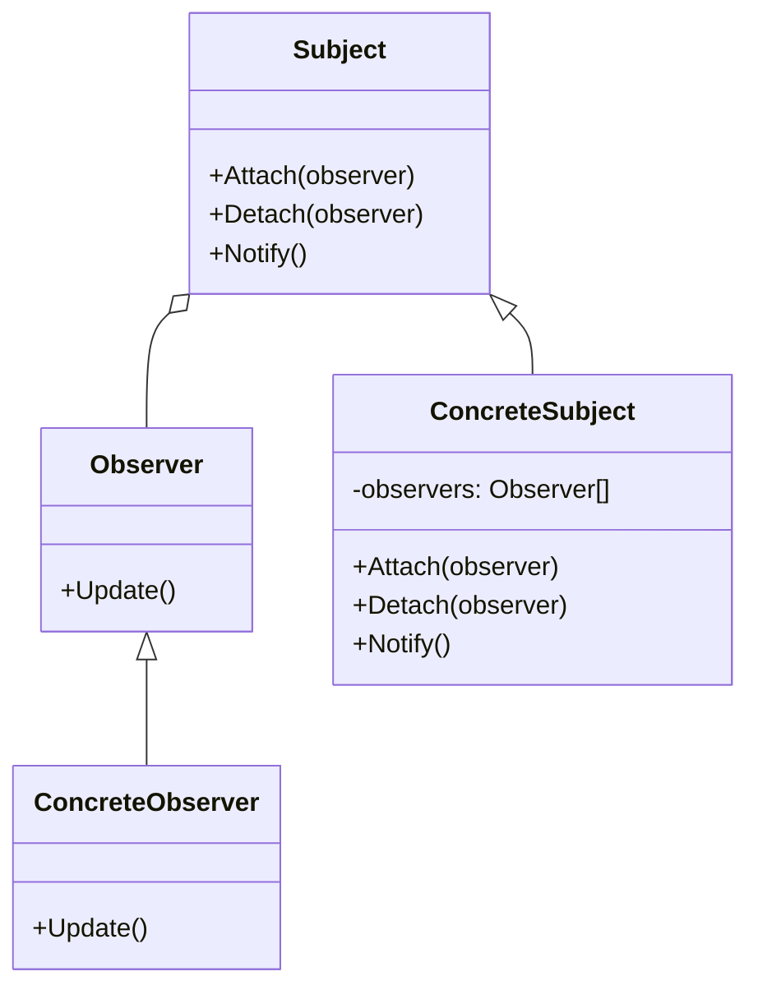

### 观察者模式

##### 角色和职责

- **Subject（被观察者或目标，抽象主题）**
  
  - 被观察的对象，状态发生变化时通知队列中所有观察者对象
  
  - 维持（添加，删除，通知）一个观察者对象的队列列表

- **ConcreteSubject（具体被观察者或目标，具体主题）**
  
  - 被观察者的具体实现，包含基本的属性状态及其他操作

- **Observer（观察者）**
  
  - 接口或抽象类，状态变化时观察者会被callback函数通知

- **ConcreteObserver（具体观察者）**
  
  - 观察者的具体实现，得到通知后将完成一些具体的业务逻辑处理

##### 适用场景

- **稳定：一对多的依赖关系关系；变化：通知与更新的实现/观察者数量**

- 一对多：定义一个目标对象对多个观察者的依赖关系

- 变化通知：目标对象发生改变，所有依赖的观察者都被通知并自动更新

- 松耦合：建立稳定的依赖关系但弱化依赖关系，可以独立地改变任一方

- 全局变量的更新？

##### 类图



##### 实现

```go
// 观察者接口
type Observer interface {
    Update()
}
// 主题接口
type Subject interface {
    Attach(observer Observer)
    Detach(observer Observer)
    Notify()
}
// 具体观察者
type ConcreteObserver struct {}
func (co *ConcreteObserver) Update() {
    fmt.Println("ConcreteObserver received the update signal.")
}
// 具体主题
type ConcreteSubject struct {
    observers []Observer
}
func (cs *ConcreteSubject) Attach(observer Observer) {
    cs.observers = append(cs.observers, observer)
}
func (cs *ConcreteSubject) Detach(observer Observer) {
    for i, o := range cs.observers {
        if o == observer {
            cs.observers = append(cs.observers[:i], cs.observers[i+1:]...)
            break
        }
    }
}
func (cs *ConcreteSubject) Notify() {
    for _, observer := range cs.observers {
        observer.Update()
    }
}

func main() {
    subject := &ConcreteSubject{}     // 主题
    observer1 := &ConcreteObserver{}  // 观察者1
    observer2 := &ConcreteObserver{}  // 观察者2
    subject.Attach(observer1)          // 添加观察者
    subject.Attach(observer2)      
    subject.Notify()                  // 通知观察者
    subject.Detach(observer2)         // 移除观察者
    subject.Notify()              
}
```