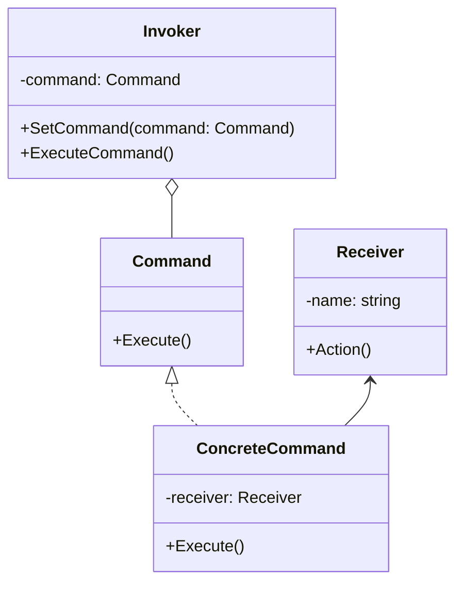

### 命令模式

##### 角色和职责

- **Command（抽象命令类）**
  
  - 抽象类或接口，声明用于执行请求的execute()等方法
  
  - 这些方法可以调用请求接收者的相关操作

- **ConcreteCommand（具体命令类）**
  
  - 抽象命令类的子类，对应具体的对象，并绑定接收者的动作
  
  - execute()方法的实现调用接收者对象的相关操作(Action)

- **Invoker（调用者）**
  
  - 请求发送者，通过命令对象来执行请求
  
  - 调用者只与抽象命令类之间存在关联关系
  
  - 运行时调用具体命令对象的execute()方法

- **Receiver（接收者）**
  
  - 接收者执行与请求相关的操作，它具体实现对请求的业务处理

##### 适用场景

- **稳定：调用者命令接收者的关系；变化：命令/行为及与其绑定的接受者的数量与实现**

- 对行为进行“记录（行为日志）、撤销/重做、事务、排队、定时”等处理

- 复合命令：通过组合模式将多个命令/行为封装为复合命令

- 将行为（请求）封装/抽象为对象，将行为调用者与接收者解耦

##### 类图



##### 实现

```go
// 命令接口
type Command interface {
    Execute()
}
// 接收者
type Receiver struct {
    Name string
}
func (r *Receiver) Action() {
    fmt.Printf("%s执行了操作\n", r.Name)
}
// 具体命令
type ConcreteCommand struct {
    receiver *Receiver
}
func (c *ConcreteCommand) Execute() {
    c.receiver.Action()
}
// 调用者
type Invoker struct {
    command Command
}
func (i *Invoker) SetCommand(command Command) {
    i.command = command
}
func (i *Invoker) ExecuteCommand() {
    i.command.Execute()
}

func main() {
    // 创建接收者
    receiver := &Receiver{Name: "接收者"}
    // 创建具体命令并指定接收者
    command := &ConcreteCommand{receiver: receiver}
    // 创建调用者并设置命令
    invoker := &Invoker{}
    invoker.SetCommand(command)
    // 调用者执行命令
    invoker.ExecuteCommand()
}
```