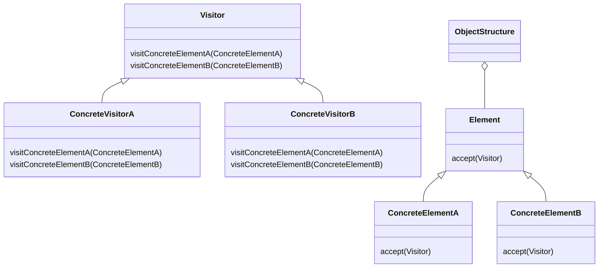

### 访问者

##### 角色和职责

- **Visitor(抽象访问者)**
  - 声明了一个或多个访问操作接口,供各种元素角色调用
  - 每个操作接收一个不同的ConcreteElement的实例作为参数
- **ConcreteVisitor(具体访问者)**
  - 实现每个从抽象访问者继承的操作
  - 每个操作都给出了有关该元素子类对象的访问操作的实现
- **Element(抽象元素)**
  - 定义一个accept操作，它以一个访问者对象作为参数
- **ConcreteElement(具体元素)**
  - 实现了抽象元素角色所定义的Accept方法,是被访问的元素
- **ObjectStructure（对象结构）**
  - 可以是一个组合（Composite）模式的实现，定义了一个能够被其内部迭代的类别
  - 或者是一个最终提供给具体访问者的数据结构

##### 适用场景

- **稳定：抽象访问者/元素和具体元素实现及数量；变化：具体访问者实现/数量**

- 在不改变原有元素代码实现的前提下，对访问者的的行为增加新的内容/变化

- 抽象/具体元素结构（成员变量）稳定，但操作算法（函数）经常变化

- 对元素（对象）结构需要提供多种不同且不相关的操作，且避免操作影响元素结构

##### 类图



##### 实现

```go
// Visitor 抽象访问者
type Visitor interface {
    VisitConcreteElementA(e *ConcreteElementA)
    VisitConcreteElementB(e *ConcreteElementB)
}
// ConcreteVisitorA 具体访问者A
type ConcreteVisitorA struct {
    // 可以有访问时需要的状态
}
func (v *ConcreteVisitorA) VisitConcreteElementA(e *ConcreteElementA) {
    // 对ConcreteElementA进行相关操作
}
func (v *ConcreteVisitorA) VisitConcreteElementB(e *ConcreteElementB) {
    // 对ConcreteElementB进行相关操作
}
// Element 抽象元素
type Element interface {
    Accept(visitor Visitor)
}
// ConcreteElementA 具体元素A
type ConcreteElementA struct {
    // 元素A的状态
}
func (e *ConcreteElementA) Accept(visitor Visitor) {
    visitor.VisitConcreteElementA(e)
}
func (e *ConcreteElementA) OperationA() {
    // 元素A的操作
}
// ConcreteElementB 具体元素B
type ConcreteElementB struct {
    // 元素B的状态  
}
func (e *ConcreteElementB) Accept(visitor Visitor) {
    visitor.VisitConcreteElementB(e)
}
func (e *ConcreteElementB) OperationB() {
    // 元素B的操作
}
// ObjectStructure 对象结构
type ObjectStructure struct {
    elements []Element
}
func (os *ObjectStructure) Add(element Element) {
    os.elements = append(os.elements, element)
}
func (os *ObjectStructure) Accept(visitor Visitor) {
    for _, element := range os.elements {
        element.Accept(visitor)
    }
}

func main() {
    visitor := &ConcreteVisitor1{}

    elementA := &ConcreteElementA{}
    elementB := &ConcreteElementB{}

    elementA.accept(visitor)
    elementB.accept(visitor)
}
```
