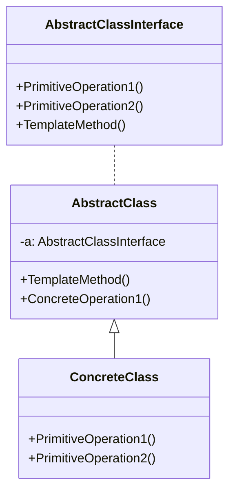
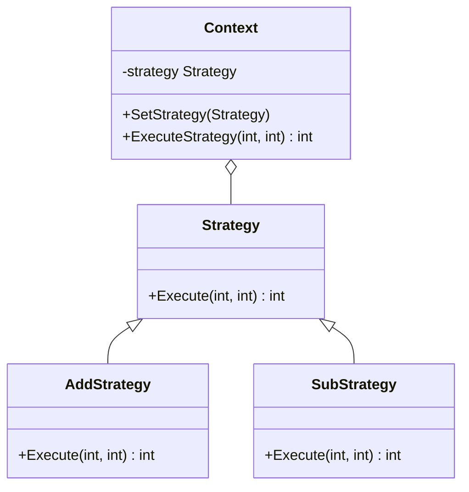
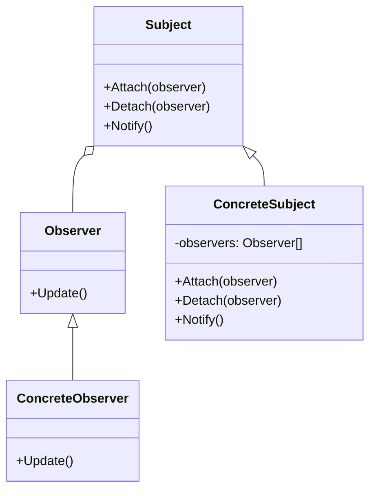
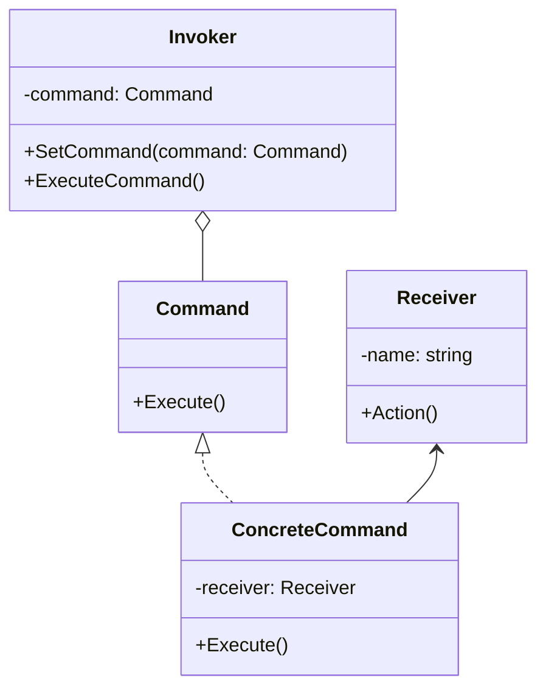

# 行为模式

### 模板方法

##### 角色和职责

- **AbstractClass（抽象类）**
  
  - 定义了一系列基本操作(PrimitiveOperations)，具体、抽象均可
  
  - 基本操作与算法步骤一一对应，子类中可重定义或实现这些步骤
  
  - 实现一个模板方法(Template Method)，用于定义一个算法的框架
  
  - 模板方法可调用抽象类或子类实现的基本方法，还可调用其他对象方法

- **ConcreteClass（具体子类）**
  
  - 是抽象类的子类，实现在父类中声明的抽象基本操作

##### 适用场景

- (1) 具有统一的操作步骤或操作过程; 

- (2) 具有不同的操作细节;  

- (3) 存在多个具有同样操作步骤的应用场景，但某些具体的操作细节却各不相同;  

##### 类图



##### 实现

```go
// 抽象类
type AbstractClass interface {
    PrimitiveOperation1()
    PrimitiveOperation2()
}
// 再封装一层，实现模板方法、抽象类公共方法
type Template struct {
    AbstractClass
}
func (a *Template) TemplateMethod() { // 抽象类实现模板方法
    a.PrimitiveOperation1()
    a.PrimitiveOperation2()
    a.ConcreteOperation1()
}
func (a *Template) ConcreteOperation1() { // 抽象类公共方法
    fmt.Println("抽象类类公共方法1实现")
}
// 利用函数实现多态
func GetAbstractClass(a AbstractClass) *Template {
    return &Template{a}
}
// 具体类
type ConcreteClass struct {
}

func (c *ConcreteClass) PrimitiveOperation1() {
    fmt.Println("具体类方法1实现")
}
func (c *ConcreteClass) PrimitiveOperation2() {
    fmt.Println("具体类方法2实现")
}
func main() {
    var a *Template = GetAbstractClass(&ConcreteClass{})
    a.TemplateMethod()
}
```

### 策略模式

##### 角色和职责

- **Context（环境类）**
  
  - 使用算法，解决问题时可采用多种策略
  
  - 维持一个对抽象策略类的引用实例

- **Strategy（抽象策略类）**
  
  - 为所支持的算法声明了抽象方法，可以是抽象类/具体类/接口
  
  - 环境类通过抽象策略类中声明的方法，在运行时调用具体策略类中实现的算法

- **ConcreteStrategy（具体策略类）**
  
  - 实现了在抽象策略类中声明的算法

##### 适用场景

- 准备一组算法，并将每一个算法封装起来，使得它们可以互换。

##### 类图



##### 实现

```go
// 策略接口
type Strategy interface {
    Execute(int, int) int
}
// 加法策略
type AddStrategy struct{}
func (s AddStrategy) Execute(a, b int) int {
    return a + b
}
// 减法策略
type SubStrategy struct{}
func (s SubStrategy) Execute(a, b int) int {
    return a - b
}
// 环境类
type Context struct {
    strategy Strategy
}
func (c *Context) SetStrategy(strategy Strategy) {
    c.strategy = strategy
}
func (c Context) ExecuteStrategy(a, b int) int {
    return c.strategy.Execute(a, b)
}
func main() {
    // 创建环境类
    context := Context{}
    // 设置加法策略
    context.SetStrategy(AddStrategy{})
    fmt.Println("10 + 5 =", context.ExecuteStrategy(10, 5))
    // 设置减法策略
    context.SetStrategy(SubStrategy{})
    fmt.Println("10 - 5 =", context.ExecuteStrategy(10, 5))
}
```

### 观察者模式

##### 角色和职责

- **Subject（被观察者或目标，抽象主题）**
  
  - 被观察的对象，状态发生变化时通知队列中所有观察者对象
  
  - 维持（添加，删除，通知）一个观察者对象的队列列表

- **ConcreteSubject（具体被观察者或目标，具体主题）**
  
  - 被观察者的具体实现，包含基本的属性状态及其他操作

- **Observer（观察者）**
  
  - 接口或抽象类，状态变化时观察者会被callback函数通知

- **ConcreteObserver（具体观察者）**
  
  - 观察者的具体实现，得到通知后将完成一些具体的业务逻辑处理

##### 适用场景

- (1) 
  
  - 一个抽象模型有两个方面，其中一个方面依赖于另一个方面
  
  - 将这两个方面封装在独立的对象中使它们可以各自独立地改变和复用。

- (2) 
  
  - 一个对象的改变将导致一个或多个其他对象也发生改变
  
  - 而并不知道具体有多少对象将发生改变，也不知道这些对象是谁。

- (3) 
  
  - 需要在系统中创建一个触发链，A对象的行为将影响B对象
  
  - B对象的行为将影响C对象……，可以使用观察者模式创建一种链式触发机制。

##### 类图



##### 实现

```go
// 观察者接口
type Observer interface {
    Update()
}
// 主题接口
type Subject interface {
    Attach(observer Observer)
    Detach(observer Observer)
    Notify()
}
// 具体观察者
type ConcreteObserver struct {}
func (co *ConcreteObserver) Update() {
    fmt.Println("ConcreteObserver received the update signal.")
}
// 具体主题
type ConcreteSubject struct {
    observers []Observer
}
func (cs *ConcreteSubject) Attach(observer Observer) {
    cs.observers = append(cs.observers, observer)
}
func (cs *ConcreteSubject) Detach(observer Observer) {
    for i, o := range cs.observers {
        if o == observer {
            cs.observers = append(cs.observers[:i], cs.observers[i+1:]...)
            break
        }
    }
}
func (cs *ConcreteSubject) Notify() {
    for _, observer := range cs.observers {
        observer.Update()
    }
}

func main() {
    subject := &ConcreteSubject{}     // 主题
    observer1 := &ConcreteObserver{}  // 观察者1
    observer2 := &ConcreteObserver{}  // 观察者2
    subject.Attach(observer1)          // 添加观察者
    subject.Attach(observer2)      
    subject.Notify()                  // 通知观察者
    subject.Detach(observer2)         // 移除观察者
    subject.Notify()              
}
```

### 命令模式

##### 角色和职责

- **Command（抽象命令类）**
  
  - 抽象类或接口，声明用于执行请求的execute()等方法
  
  - 这些方法可以调用请求接收者的相关操作

- **ConcreteCommand（具体命令类）**
  
  - 抽象命令类的子类，对应具体的对象，并绑定接收者的动作
  
  - execute()方法的实现调用接收者对象的相关操作(Action)

- **Invoker（调用者）**
  
  - 请求发送者，通过命令对象来执行请求
  
  - 调用者只与抽象命令类之间存在关联关系
  
  - 运行时调用具体命令对象的execute()方法

- **Receiver（接收者）**
  
  - 接收者执行与请求相关的操作，它具体实现对请求的业务处理

##### 适用场景

(1) 请求调用者和请求接收者解耦，两者不直接交互。

(2) 系统需要在不同的时间指定请求、将请求排队和执行请求。(不同生命周期)

(3) 系统需要将一组操作组合在一起形成宏命令。

##### 类图



##### 实现

```go
// 命令接口
type Command interface {
    Execute()
}
// 接收者
type Receiver struct {
    Name string
}
func (r *Receiver) Action() {
    fmt.Printf("%s执行了操作\n", r.Name)
}
// 具体命令
type ConcreteCommand struct {
    receiver *Receiver
}
func (c *ConcreteCommand) Execute() {
    c.receiver.Action()
}
// 调用者
type Invoker struct {
    command Command
}
func (i *Invoker) SetCommand(command Command) {
    i.command = command
}
func (i *Invoker) ExecuteCommand() {
    i.command.Execute()
}

func main() {
    // 创建接收者
    receiver := &Receiver{Name: "接收者"}
    // 创建具体命令并指定接收者
    command := &ConcreteCommand{receiver: receiver}
    // 创建调用者并设置命令
    invoker := &Invoker{}
    invoker.SetCommand(command)
    // 调用者执行命令
    invoker.ExecuteCommand()
}
```
