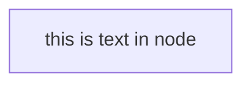
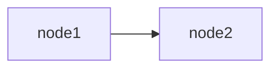
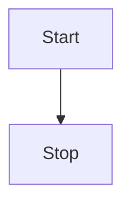
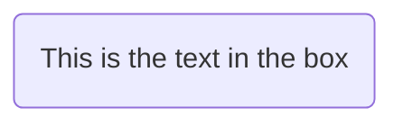
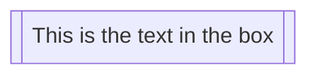
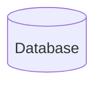

### Flow chart

- (1) A node (with text)



- (2) Graph





- (3) A node (with round edges)



- (4) A stadium-shaped node


- (5) A node in a subroutine shape



- (6) A node in a cylindrical shape



## 流程图方向

- TB - top to bottom

- TD - top-down/ same as top to bottom

- BT - bottom to top

- RL - right to left

- LR - left to right

```mermaid
<style>

</style>
flowchart TD
  subgraph Pod
    direction LR
    id1[Pause]
    id2[user container1]
    id3[user container2]
    id4[user containerN]
  end
```
