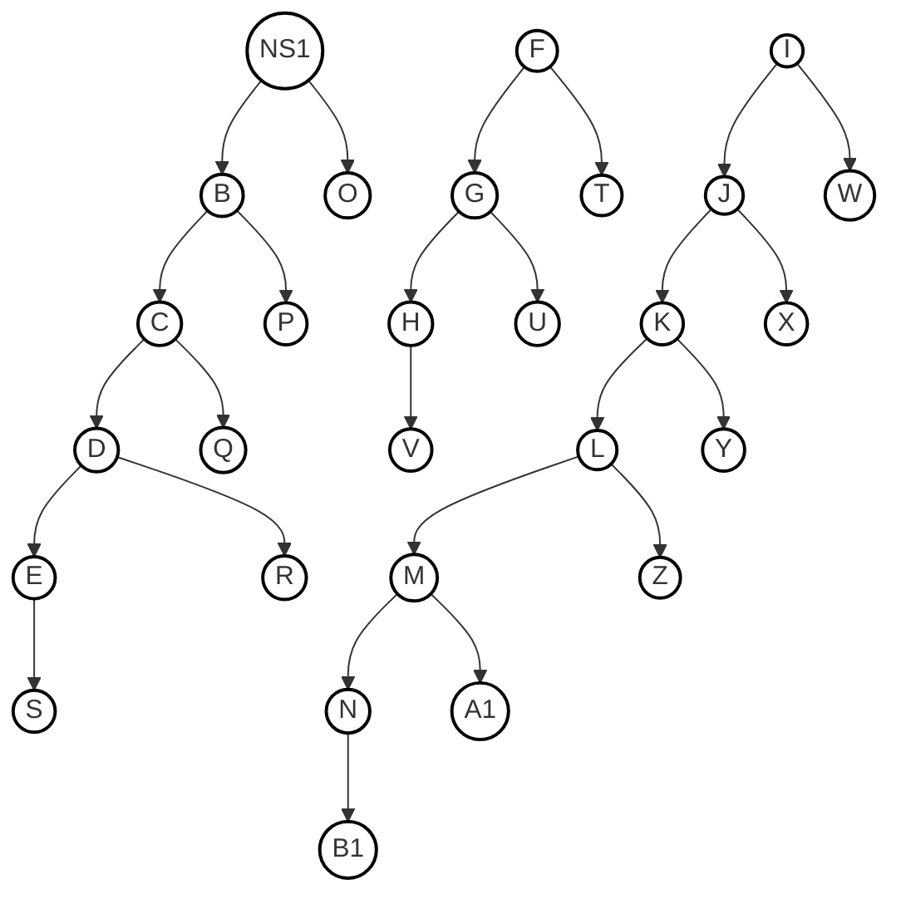
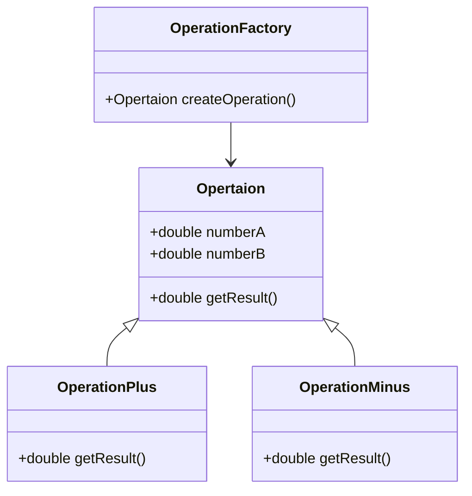

# 一级标题

## 二级标题

### 三级标题

#### 四级标题

##### 五级标题

###### 六级标题

正文

---

| 表格标题1 | 表格标题2 | 表格标题3 |
| ----- | ----- | ----- |
| 内容1   | 内容1   | 内容1   |
| 内容1   | 内容1   | 内容1   |
| 内容1   | 内容1   | 内容1   |
| 内容1   | 内容1   | 内容1   |
| 内容1   | 内容1   | 内容1   |

$$
x^2 + 5 = 10
$$

<div>

</div>

    <div class="container flex">
        HTML代码
        <div class="item i1">1</div>
        <div class="item i2">2</div>
        <div class="item i3">3</div>
        <div class="item i4">4</div>
        <div class="item i5">5</div>
        <div class="item i6">白日依山尽，黄河入海流。<br>欲穷千里目，更上一层楼。</div>
    </div>

```python
import os
print("Hello world")
```

> 这是一个提示

1. 11111

2. 22222

3. 33333
- 你好

- hello

- OK

- [ ] 要做的事1

- [x] 要做的事2

- [ ] 要做的事3




